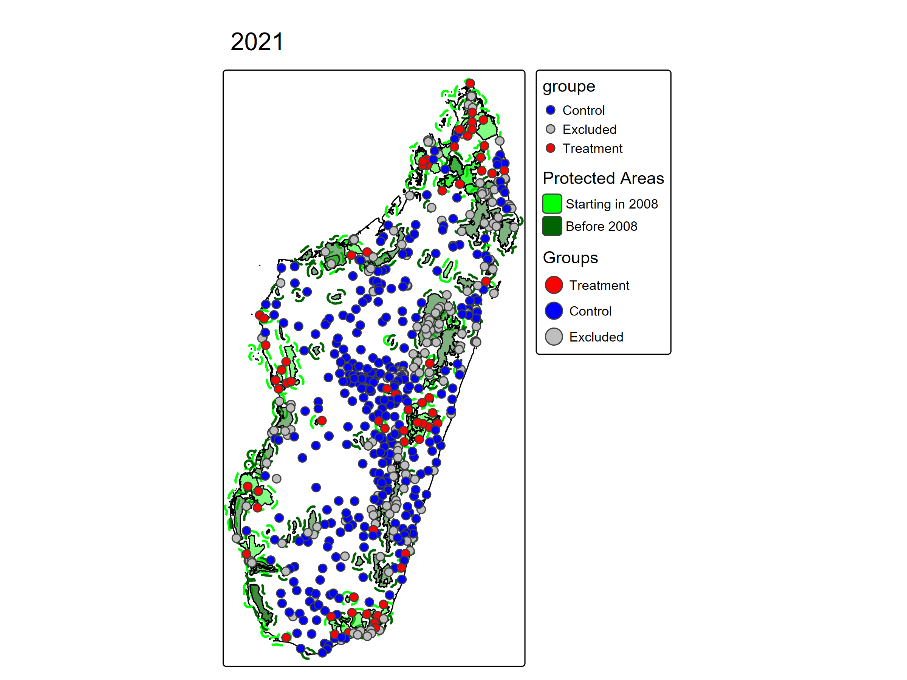
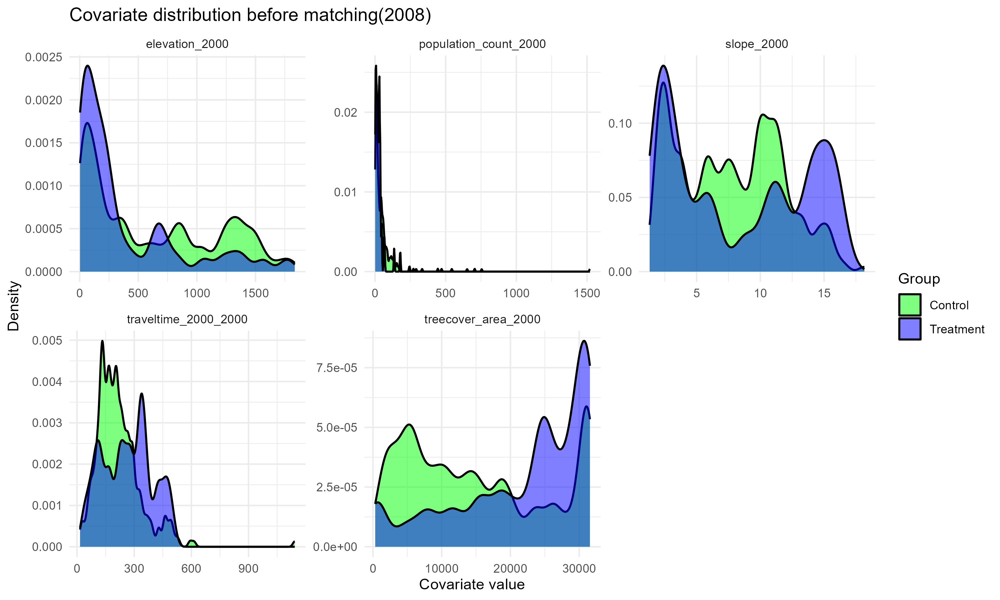
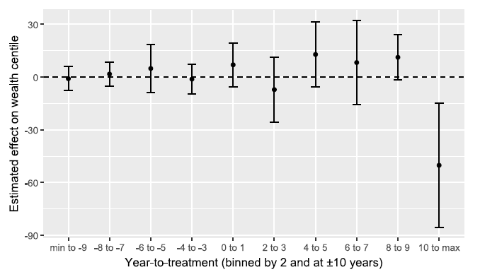
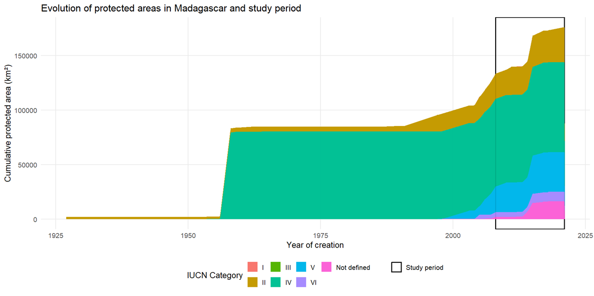

# Context


## To what extent do protected areas (PA) impact household living standards?

\hyperlink{annexe-theory-change}{\beamerbutton{$\triangleright$ Theory of change}}

  - **Economic Opportunities**
    - Development of local tourism [@Naidoo2019],
    - Creation of conservation-related jobs [@baliettiLaborMarketImpacts2024]
    - Compensation measures [@Poudyal2018]
    - Improved ecosystem services [@Xu2023]
      
 - **Restrictions and Costs** 
Restricted access to natural resources - gathering, hunting, fishing, medicinal plants [@Kandel2022]
      
 - **Heterogeneous results**
Effects vary across evaluation methods, institutional contexts, and geographic locations [@Kandel2022].


## **How would household living conditions have evolved if PA had not been established?**


\begin{columns}[T]

\begin{column}{0.48\linewidth}

\textcolor{vertfonce}{\textbf{Research Design}}

\small
\begin{itemize}
\item \textbf{Q1 :} Do PA worsen the living conditions of local communities?
\item \textbf{Q2 :} Do PA increase inequality among local communities?
\item \textbf{Q3 :} Do the impacts vary by type of PA?
\end{itemize}

\end{column}

\begin{column}{0.04\linewidth}
\end{column}

\begin{column}{0.48\linewidth}

\textcolor{orange}{\textbf{Hypothesis}}

\small
\begin{itemize}
\item \textbf{H1 :} PA in Madagascar may reduce well-being by limiting access to natural resources.
\item \textbf{H2 :} PA may increase inequality through uneven access to benefits.
\item \textbf{H3 :} Impacts are heterogeneous depending on governance and context.
\end{itemize}

\end{column}

\end{columns}


## Madagascar is a relevant study case
\hyperlink{annexe-evolution-PA}{\beamerbutton{$\triangleright$ Evolution of protected areas}}

:::: columns

::: {.column width="52%"}
**Surface of PA and Size of the adjacent population exposed to them nearly tripled between 2008 and 2021**

- 2008: 3,6% of the territory — 9% population lived < 10 km of PAs 
- 2021: 10,8% du territoire — 28% population lived > 10 km of PAs 

**A vulnerable socio-economic context **

- The world's poorest country based on SDG Indicator 1.1 [@Conceicao2024]  
- High dependence on natural resources [@Llopis2023]  
- Weak state capacity [@Hanson2021]


\vspace{0.1cm}


:::

::: {.column width="48%"}

```{r}
#| echo: false
#| out-width: "100%"

knitr::include_graphics("images/carte_AP.png")
```
\tiny Source : Authors

:::

::::


# Empirical methodology {background-color="#f8f9fa"}

## The data at the rural level 
\hyperlink{annexe-empirical-methodology}{\beamerbutton{$\triangleright$ "Summary statistics}}
  
  \begin{table}[ht]
\centering
\vbox{
\resizebox{0.90\textwidth}{!}{ 
\tiny % Force tout le texte du tableau à être très petit
\begin{tabular}{>{\columncolor{vertclair}}p{2.2cm} p{3.4cm} p{4.6cm}}
\toprule
\rowcolor{vertfonce}
\textcolor{white}{\textbf{Role in the analysis}} &
\textcolor{white}{\textbf{Variable names}} &
\textcolor{white}{\textbf{Data source}} \\
\midrule
Treatment variable & Protected Areas & \textit{World Database on Protected Areas} (2025) \\
\midrule
& Indice niveau de vie & \textit{DHS/MIS/MICS} (1997, 2008, 2011, 2016, 2018, 2021) \\
\multirow{-2.2}{2.2cm}{Outcome variable} & Zscore of the wealth index & \\
\midrule
& Forest cover rates in 2000 & \textit{Global Forest Change} [Hansen2013] \\
& Population density in 2000 & \textit{WorldPop} [WorldPop2018] \\
& Accessibility (2000) & \textit{JRC} [Uchida2011] \\
\multirow{-4}{2.2cm}{Matching variables} & Slope and elevation & NASA-SRTM [@NASAJPL2020] \\
\midrule
& Sex and age of the head of household & \textit{DHS/MIS/MICS} (1997, 2008, 2011, 2016, 2018, 2021) \\
\multirow{-2.2}{2.2cm}{Control variables} & Drought index (SPEI) [@VicenteSerrano2010] & \\
\bottomrule
\end{tabular}
}
}
\end{table}
  

## Counterfactual analysis
:::: columns

::: {.column width="48%"}

  - **Treatment**: Establishment of PA between 2008 and 2021

  - **Treatment group**: Rural Households located in clusters < 10 km of PA created between 2008 and 2021 
  - **Control group**: Rural Households located in clusters > 10 km of PA created between 2008 and 2021
  - **Excluded group**: Households located in clusters within < 10 km of PA created before 2008 and in urban areas 


\vspace{0.3cm}


:::

::: {.column width="52%"}
```{r}
#| echo: false
#| out-width: "110%"

```
\tiny Source: Authors based on DHS, WDPA data
:::

::::


##  Estimating the impact of PA on living condition

- **Genetic matching**: To compare observable characteristics between the treatment group and the control group [@Diamond2013] 
\hyperlink{annexe-matching}{\beamerbutton{$\triangleright$ Matching }}

- **Difference-in-difference (DID)**


::: {title="Baseline Equation"}
\small
$$
Y_{ict} = \alpha + \delta \cdot (\mathrm{Treatment}_c \times \mathrm{Post}_t) + X_{ict}' \theta + \mu_c + \lambda_t + \varepsilon_{ict}
$$ 
:::

\tiny
\setlength{\itemsep}{0pt}
\setlength{\parskip}{0pt}
\setlength{\parsep}{0pt}
\setlength{\topsep}{0pt}

\begin{itemize}
  \item $Y_{ict}$: wealth index (hh $i$, cluster $c$, year $t$)
  \item $\delta$: DID effect (PA → welfare)
  \item $\text{Treat}_c \times \text{Post}_t$: DID term
  \item $\mu_c,\lambda_t$: time FE (common shocks)
  \item $X_{ict}$: controls (age/sex of the head of household, SPEI, accessibility, population density, forest cover rate, slope, altitude)
\end{itemize}


# Results

## Matching

:::: columns

::: {.column width="50%"}
### Before 2008

{width=100%}
:::

::: {.column width="50%"}
### After matching 2008

{width=100%}
:::

::::

## PA impact on the household wealth index
\hyperlink{annexe-result-h1}{\beamerbutton{$\triangleright$ Impact on well-being: Event study with 2 year bins}}

{width=80%}


## PA impact on the household wealth index inequalities
\hyperlink{annexe-result-h2}{\beamerbutton{$\triangleright$ "Impact on inequalities: Event-study with 2-year bins}}


{width=80%}


## Heterogeneity: Which PA Harm Most?
\hyperlink{annexe-result-h3}{\beamerbutton{$\triangleright$ "Heterogeneity of impact on well-being}}

{width=80%}

## Robustness Test 

- **Distance threshold test of 5 km and 15km**: Proximity to PA has no significant effect on wealth
- **Pseudo-panel analysis**: the results confirm the robustness of the conclusions in that environmental and spatial conditions have a stronger influence on household living standards than sociodemographic characteristics
- **Heterogeneity analysis**: The effects are not robust to the presence of unobserved bias
- **Other outcome variables (Child size/weight and infant mortality**): No significant effect is found in the estimation 

## Conclusions

- PA do not lower the standard of living, but costs accumulate over time 

- No significant average effect on the standards of living - losses associated with restrictions appear to be offset by adaptation mechanisms and local opportunities 

- No significant effect on inequality - the main determinants remain climate shocks and sociodemographic characteristics

- No differentiated effect based on governance type - formal categories alone do not explain socioeconomic outcomes 


**Policy Implications**:
- Integration of systematic socioeconomic monitoring into protected area governance frameworks
- Strengthening of transparent compensation mechanisms
- Design of inclusive benefit-sharing mechanisms that address equity concerns


## {.unnumbered}

\vfill

\begin{center}

{\Large \textbf{Thank you for your attention}}

\vspace{1cm}

{\normalsize \textit{Questions \& Discussion}}

\vspace{1.5cm}

{\small \textbf{Contact:} iriana\_ny\_aina.razafimahenina@ird.fr}

\end{center}

\vfill


## References {.allowframebreaks}

\footnotesize

::: {#refs}
:::


# Appendix {.unnumbered}

\appendix

## Theory of Change {.unnumbered}

\hypertarget{annexe-theory-change}{}

\begin{figure}
  \centering
  \includegraphics[width=0.95\textwidth, height=0.75\textheight, keepaspectratio]{images/theory_of_change.png}
  \caption{\tiny Logic diagram of the theory of change}
  \tiny{\textit{Source : Auteurs}}
\end{figure}


\hyperlink{slide-context}{\beamerbutton{$\leftarrow$ Back}}


## Evolution of protected areas {.unnumbered}

\hypertarget{annexe-evolution-PA}{}


```{r}
#| echo: false
#| out-width: "90%"


```

\hyperlink{slide-context}{\beamerbutton{$\leftarrow$ Back}}


## Summary statistics: Distribution of the rural wealth index {.unnumbered}

\hypertarget{annexe-empirical-methodology}{}

{#fig-distr-wi width="80%"}

*Source: Authors*


\hyperlink{slide-empirical-methodology}{\beamerbutton{$\leftarrow$ Back}}


## Summary statistics: Distribution of the Z-score of the rural wealth index {.unnumbered}

{#fig-distr-zs width="80%"}

*Source: Authors*

\hyperlink{slide-empirical-methodology}{\beamerbutton{$\leftarrow$ Back}}

## Descriptive statistics {.unnumbered .shrink}

\hyperlink{annexe-empirical-methodology}{\beamerbutton{$\triangleright$ Descriptive statistics}}


```{r}
#| label: tbl-gt-desc-AP
#| tbl-cap: "Descriptive statistics for protected areas created before 2008 and from 2021"
#| warning: false
#| message: false
#| echo: false

library(tidyverse, warn.conflicts = FALSE)
library(gt)

library(tidyverse)
library(gt)

tbl_gt_desc_AP <- read_rds("tables/desc_AP_combined.rds")

tbl_gt_desc_AP %>%
  gt() %>%                           # <- Transformer le tibble en gt_tbl
  fmt_number(
    columns = where(is.numeric),     # Arrondir toutes les colonnes numériques
    decimals = 2
  ) %>%
  tab_options(
    table.width          = pct(100),
    column_labels.font.size = 8,     # réduit
    table.font.size         = 7,     # réduit
    data_row.padding        = px(2), # réduit l'espacement entre lignes
    column_labels.padding   = px(2)
  )

```


## Matching {.unnumbered .shrink}

\hypertarget{annexe-evolution-PA}{}

\small

```{r}
#| label: tbl-balance-long-2008
#| tbl-cap: "Standardized Mean Difference of the Year 2008 and 2021"
#| warning: false
#| message: false
#| echo: false
balance_long_2008 <- readRDS("tables/tab_smd.rds")
balance_long_2008 %>%
  tab_options(
    table.width             = pct(100),
    column_labels.font.size = 8,
    table.font.size         = 7,
    data_row.padding        = px(2),
    column_labels.padding   = px(2)
  )
```

\hyperlink{slide-context}{\beamerbutton{$\leftarrow$ Back}}


## Impact on well-being: Event-study with 2-year bins {.unnumbered}


\hypertarget{annexe-result-h1}{}

```{r}
#| label: tbl-h1-staggered-static
#| tbl-cap: "Static treatment effect estimates on well-being"
#| warning: false
#| message: false
#| echo: false
h1_staggered_static_tb <- read_rds("tables/h1_staggered_static_tb.rds")

# Échapper les underscores
h1_staggered_static_tb@data <- h1_staggered_static_tb@data %>%
  mutate(across(where(is.character), ~ gsub("_", "\\\\_", .x)))

h1_staggered_static_tb@data_body <- h1_staggered_static_tb@data_body %>%
  mutate(across(where(is.character), ~ gsub("_", "\\\\_", .x)))

h1_staggered_static_tb

```


\hyperlink{slide-result-h1}{\beamerbutton{$\leftarrow$ Back}}


## Impact on inequalities: Event-study with 2-year bins {.unnumbered}


\hypertarget{annexe-result_h2}{}

```{r}


#| label: tbl-h2-staggered-static
#| tbl-cap: "Static treatment effect estimates on inequalities"
#| warning: false
#| message: false
#| echo: false
library(tinytable)
h2_staggered_static_tb <- read_rds("tables/h2_staggered_static_tb.rds")

# Échapper les underscores dans les données
h2_staggered_static_tb@data <- h2_staggered_static_tb@data %>%
  mutate(across(where(is.character), ~ gsub("_", "\\\\_", .x)))

h2_staggered_static_tb@data_body <- h2_staggered_static_tb@data_body %>%
  mutate(across(where(is.character), ~ gsub("_", "\\\\_", .x)))

h2_staggered_static_tb
```


\hyperlink{slide-result-h2}{\beamerbutton{$\leftarrow$ Back}}


