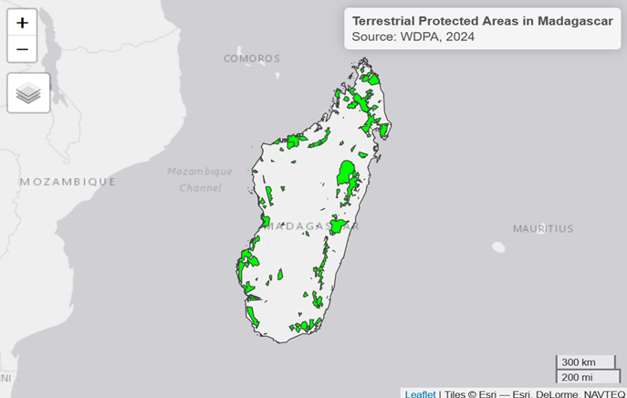
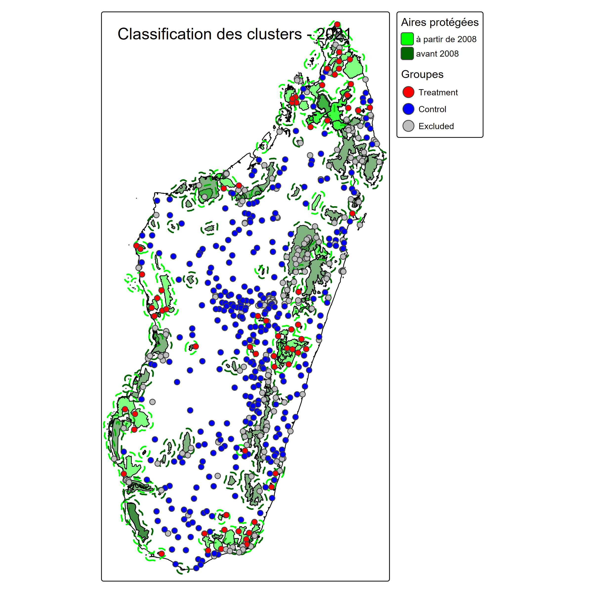
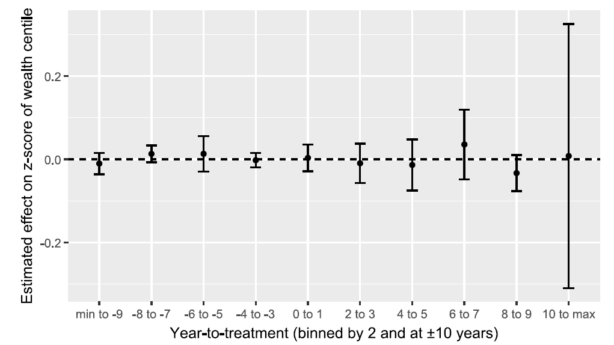
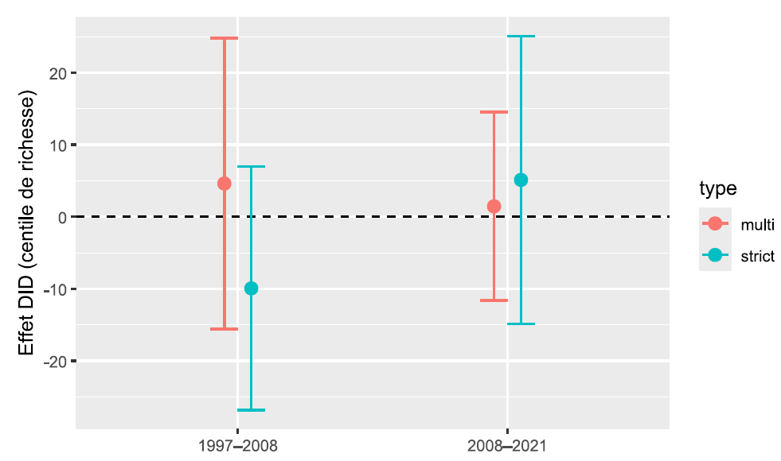

## To what extent do protected areas impact household living standards?
  - **Economic Opportunities**
    - Development of local tourism [@Naidoo2019],
    - Creation of conservation-related jobs [@baliettiLaborMarketImpacts2024]
    - Compensation measures [@Poudyal2018]
    - Improved ecosystem services [@Xu2023]
      
 - **Restrictions and Costs** 
Restricted access to natural resources - gathering, hunting, fishing, medicinal plants [@Kandel2022]
      
 - **Heterogeneous results**
Effects vary across evaluation methods, institutional contexts, and geographic locations [@Kandel2022].


## Research design 

```{=latex}
\begin{tikzpicture}[
  box/.style={
    draw,
    rounded corners=4pt,
    minimum width=\textwidth,
    text width=\dimexpr\textwidth-12pt\relax,
    align=left,
    inner sep=8pt
  },
  smallbox/.style={
    draw,
    rounded corners=4pt,
    minimum width=0.47\textwidth,
    text width=\dimexpr0.47\textwidth-12pt\relax,
    align=left,
    inner sep=8pt
  }
]

\node[box] (top) {
\textbf{Research Questions}\\[6pt]
-- Do protected areas (PAs) worsen the living conditions of local communities?\\[3pt]
-- Do protected areas (PAs) increase inequalities among local communities?\\[3pt]
-- Do the impacts of protected areas vary according to the type of protected area?
};

\node[
smallbox,
below left=8pt and 0pt of top.south west,
anchor=north west
] (left) {

\textbf{Research Design}\\[6pt]

To what extent do protected areas affect household living standards?

};

\node[
smallbox,
below right=8pt and 0pt of top.south east,
anchor=north east
] (right) {

\textbf{Contribution}\\[6pt]

-- National analysis of 84 protected areas.\\[3pt]
-- Quantitative assessment of the impact of protected area creation on household living conditions.

};

\end{tikzpicture}

```


## Why Madagascar?  
::: {.columns align=top}

::: {.column width="48%"}
\small

**Area of protected areas and Size of the adjacent population exposed to them nearly tripled between 2008 and 2021**

- 2008: 3,6% of the territory — 9% population lived < 10 km of protected area 
- 2021: 10,8% du territoire — 28% population lived > 10 km of protected area 

**A Vulnerable socio-economic context **

- The world's poorest country based on SDG Indiator 1.1 [@Conceicao2024]  
- High dependence on natural resources [@Llopis2023]  
- Weak state capacity [@Hanson2021]

:::

::: {.column width="5%"}

:::

::: {.column width="48%"}
\small


```{r}
#| echo: false
#| out-width: "105%"


```
\tiny Source : Authors
:::

:::


## Theory of Change

\begin{figure}
  \centering
  \includegraphics[width=0.95\textwidth, height=0.75\textheight, keepaspectratio]{images/theory_of_change.png}
  \caption{\tiny Logic diagram of the theory of change}
  \tiny{\textit{Source : Auteurs}}
\end{figure}


# Empirical methodology {background-color="#f8f9fa"}

## The data at the rural level 
  
  - Combine geolocated household data from six nationally representative survey waves Demographic and Health surveys (1997, 2008, 2021), Malaria Indicator Surveys (2011, 2013, 2016)
and Multiple Indicator Cluster Surveys (2018) - with the World Database on Protected Areas and
geospatial environmental covariates (forest cover, slope, elevation, population density, accessibility,
and standardized precipitation evapotranspiration index).
  
  - **Dependent variable**: Protected Areas Implementation, from WDPA, SAPM 
  
  - 
  
  - **Treatment group**: households living in rural areas < 10 km of a Protected areas created between 2008 and 2021
  
  - **Control group**: households living in rural areas < 10 km of a Protected areas created between 2008 and 2021
  


\definecolor{orangeaccent}{RGB}{46,125,50}

\small
```{r}
#| echo: false
#| out-width: "90%"


```
\tiny Source : DHS,MICS,MIS, Authors
  
  
  
## Baseline model: protected areas, living conditions, and rural 


# Results

## Protected Areas impact on the household wealth index


{fig-align="center"}


## Protected Areas impact on the household wealth index inequalities 
{fig-align="center"}


## Heterogeneity: Which Protected Areas Harm Most?  
{fig-align="center"}

## Policy Implications 


## References

::: {#refs}
:::


