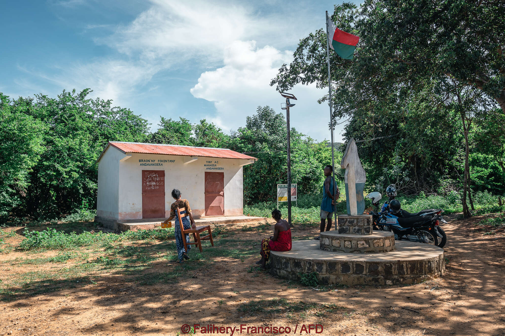
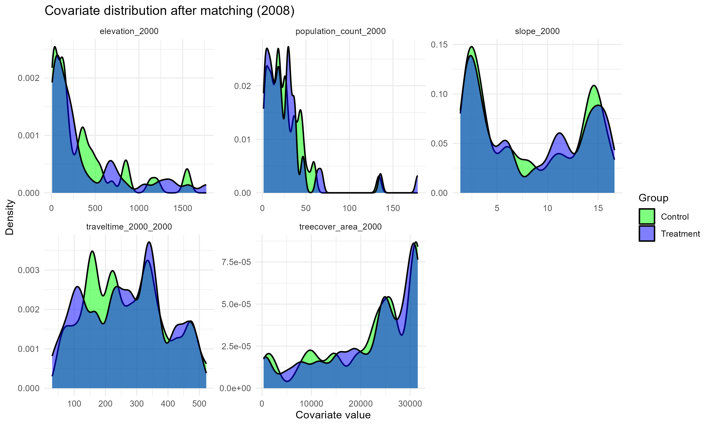
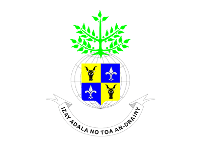
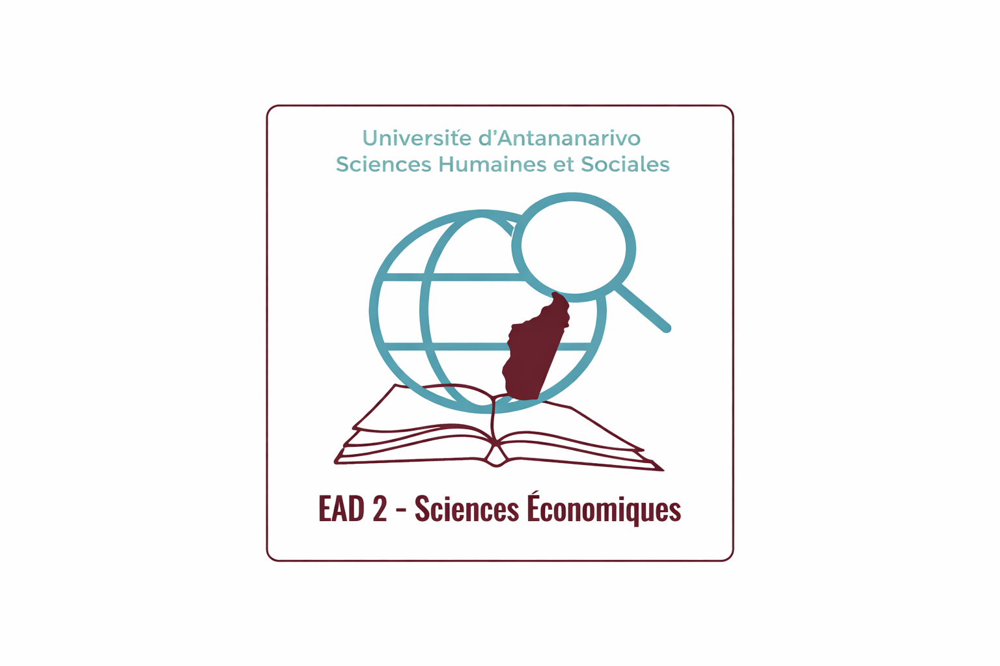
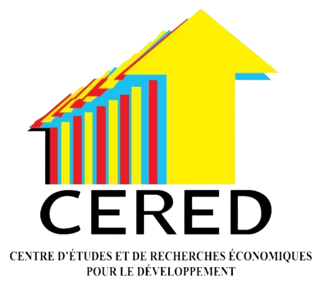

# Introduction {background-color="#f8f9fa"}

## Les aires protégées poursuivent des objectifs de conservation
Une aire protégée est définie comme "un **espace géographique** clairement défini, reconnu, consacré et géré, par tout moyen efficace, juridique ou autre, afin **d'assurer à long terme la conservation de la nature** ainsi que les **services écosystémiques** et les **valeurs culturelles** qui lui sont associées. [@Day2008]

**Trois objectifs principaux:**

  - Conservation de la nature - forêts, biodiversité, espèces, écosystèmes
  - Conservation des services écosystémiques - bois, eau douce, plantes médicinales, services de régulation et culturels  
  - Conservation des valeurs culturelles - pratiques traditionnelles de gestion, sites sacrés

=> Ces Objectifs de conservation sont-ils compatibles avec l'amélioration des conditions de vie des populations riveraines? 

## Les effets sur les populations locales restent mal connus et contradictoires 

 - **Opportunités économiques**
 
    - Développement du tourisme local [@Naidoo2019], 
    - Création d'emplois liées à la conservation [@baliettiLaborMarketImpacts2024]
    - Mesures de compensation [@Poudyal2018]
    - Amélioration des services écosystémiques [@Xu2023]
      
 - **Restriction et coûts** 
Limitation de l'accès aux ressources naturelles - cueillette, chasse, pêche, plantes médicinales [@Kandel2022]
      
 - **Des résultats hétérogènes**
Les effets varient selon les méthodes d'évaluation, le contexte institutionnel et la localisation géographique [@Kandel2022]. 
      

##  Notre question: **dans quelle mesure les AP affectent-elles le niveau de vie des ménages? **


::: {.columns align=top}

::: {.column width="48%"}
\textcolor{vertfonce}{\textbf{Questions de recherche}}

\small
* **Q1 :** Est-ce que les AP dégradent les conditions de vie des populations locales ?
* **Q2 :** Est-ce que les AP accroissent les inégalités au sein des populations locales ?
* **Q3 :** Est-ce que les impacts des AP varient selon le type d'AP ?
:::

::: {.column width="4%"}

:::

::: {.column width="48%"}
\textcolor{orangeaccent}{\textbf{Hypothèses}}

\small
* **H1 :** Les aires protégées réduisent le niveau de vie des ménages voisins en limitant l'accès aux ressources naturelles, sans compensations ni avantages suffisants. 
* **H2 :** Les aires protégées exacerbent les inégalités économiques parmi les communautés voisines. 
* **H3:** Les impacts ds aires protégées varient d'une aire protégée à l'autre en fonction de la gouvernance, de la participation communautaire et des approches de gestion 
:::

:::

## Madagascar: un laboratoire idéal pour tester ces effets (1/2)

**Les études empiriques existantes sont très localisées et agrégées au niveau communal** [@Mammides2020a]: 

  - Analyse des coûts d'opportunités à Ranomafana (Sud-Est) [@Ferraro2002]: en moyenne, les ménages supportent 19 à 70$/an de coûts d'opportunité
  
  - Evaluation de l'efficacité des investissements en matière de conservation et de développement dans le corridor d'Ankeniheny-Zahamena (Nord-Est/centre-Est)[@Tabor2017]  
  
  - Impacts contrastés des aires protégées et cultures de rente sur le bien être (Nord-est) [@Llopis2023a]: Effets négatifs accrus sur les ménages dépendants de la forêt  

## Madagascar: un laboratoire idéal pour tester ces effets (2/2)
::: {.columns align=top}

::: {.column width="48%"}
\small

**La superficie des AP et la population riveraine exposée ont presque triplé entre 2008 et 2021**

- 2008 : 3,6% du territoire — 9% pop. à < 10 km d'une AP  
- 2021 : 10,8% du territoire — 28% pop. à < 10 km d'une AP  

- **Un contexte socio-économique fragile**

- Pays le plus pauvre au sens de l’ODD 1-1 [@Conceicao2024]  
- Forte dépendance aux ressources naturelles [@Llopis2023]  
- Faible capacité de l’État [@Hanson2021]
:::

::: {.column width="5%"}

:::

::: {.column width="48%"}
\small

```{r}
#| echo: false
#| out-width: "90%"


```
\tiny Source : © Falihery-Francisco / AFD
:::

:::

# Contribution

- Analyse couvrant **84 aires protégées terrestres créées entre 2008 et 2021**
- Evaluation quantitative de la création des aires protégées sur les conditions de vie des ménages 

\begin{table}[ht]
\centering

\begin{tabular}{lrr}
\hline
\textbf{Période de création} & \textbf{Nombre d'Aire protégée$^{a}$} & \textbf{Superficie (km$^{2}$)} \\
\hline
Avant 2008     & 60  & 47,159.76 \\
A partir de 2008 & 84  & 38,983.40 \\
\hline
\textbf{Total}  & \textbf{144} & \textbf{86,143.16} \\
\hline
\end{tabular}

\vspace{0.3cm}

\begin{minipage}{0.9\textwidth}
\footnotesize
$^{a}$ Aire protégée définie selon les catégories IUCN (I--VI)

\textbf{Source:} World Database on Protected Areas (WDPA), 2025 ou SAPM, 2023.
\end{minipage}
\end{table}

# Cadre d'analyse méthodologique

## Données et sources

\begin{table}[ht]
\centering
\vbox{
\resizebox{0.90\textwidth}{!}{ 
\tiny % Force tout le texte du tableau à être très petit
\begin{tabular}{>{\columncolor{vertclair}}p{2.2cm} p{3.4cm} p{4.6cm}}
\toprule
\rowcolor{vertfonce}
\textcolor{white}{\textbf{Rôle dans l'analyse}} &
\textcolor{white}{\textbf{Nom des variables}} &
\textcolor{white}{\textbf{Source des données}} \\
\midrule
Ce que nous testons & Aire protégée & \textit{WDPA} (2025) \\
\midrule
& Indice niveau de vie & \textit{DHS/MIS/MICS} (1997--2021) \\
\multirow{-2.2}{2.2cm}{Ce que nous mesurons} & Indice d'inégalité & \\
\midrule
& Couvert forestier & \textit{GFC} [@Hansen2013] \\
& Densité pop. (2000) & \textit{WorldPop} [@WorldPop2018] \\
& Accessibilité (2000) & \textit{JRC} [@Uchida2011] \\
\multirow{-4}{2.2cm}{Critères de comparaison} & Altitude et pente & NASA-SRTM [@NASAJPL2020] \\
\midrule
& Âge et sexe chef ménage & \textit{DHS/MIS/MICS} (1997--2021) \\
\multirow{-2.2}{2.2cm}{Autres éléments} & Indice sécheresse (SPEI) & \\
\bottomrule
\end{tabular}
}
}
\end{table}

\vspace{-0.25cm}
\begin{center}
\includegraphics[height=0.65cm]{images/logo_mapme.png}\hspace{0.15cm}
\includegraphics[height=0.65cm]{images/logo_instat.png}\hspace{0.15cm}
\includegraphics[height=0.65cm]{images/logo_usaid.png}\hspace{0.15cm}
\includegraphics[height=0.65cm]{images/logo_protected_planet.png}
\end{center}

## Unité d'analyse
:::: columns

::: {.column width="50%"}

  - **Traitement**: Mise en place des aires protégées

  - **Groupe de traitement**: Ménages localisées dans les clusters à < 10 km des AP créées entre 2008 et 2021 dans les zones rurales 
  - **Groupe de contrôle**: Ménages localisées dans les clusters à > 10 km des AP créées entre 2008 et 2021 dans les zones rurales 
  - **Groupe à exclure**: Ménages localisés dans les clusters à < 10 km des AP créées avant 2008 et dans les zones urbaines 


\vspace{0.3cm}


:::

::: {.column width="50%"}


```{r}
#| echo: false
#| warning: false
#| message: false
#| out.width: "90%"
#| fig.align: "center"

knitr::include_graphics(
  "C:/Users/irian/Documents/Analyse de données/PA-livelihood-impact-dhs/Presentation/conference_BETSAKA/images/map_2021_groups.png"
)
```

:::

::::


## Méthodes d'estimation 

- **Genetic matching**

La méthode de genetic matching sert à comparer les caractéristiques observables et à accroître la similitude entre le groupe de traitement et le groupe de contrôle [@Diamond2013]. 

- **Difference-in-difference (DID)**

La méthode DID permet de comparer les évolutions observées des niveaux de vie des ménages locaux avant et après la mise en place des aires protégées. Elle repose sur l'hypothèse des tendances parallèles, qui postule que les zones traités et non traitées suivaient des trajectoires similaires avant l'intervention. 

## Matching

:::: columns

::: {.column width="50%"}
### Avant 2008

{width=100%}
:::

::: {.column width="50%"}
### Après 2008

{width=100%}
:::

::::


## Résultats de l'hypothèse 1

:::: columns

::: {.column width="50%"}

**Hypothèse 1 : En moyenne, les aires protégées réduisent le niveau de vie des ménages ruraux**

- Pas d'effet significatif de la création d'AP sur l'indice de richesse des ménages.
- Pertes associées aux restrictions compensées par des gains d'ailleurs — emplois liés à la conservation, services écosystémiques, activités de subsistance.
- Effets compensatoires peuvent neutraliser l'impact global à court et moyen terme.
:::

::: {.column width="50%"}
{fig-align="center"}
:::

::::

## Résultats de l'hypothèse 2

:::: columns

::: {.column width="50%"}
**Hypothèse 2 : Les aires protégées exacerbent les inégalités économiques parmi les communautés voisines**

- Pas d'effet significatif de la création d'AP sur les inégalités de richesse
- Déterminants principaux des inégalités liées à des dynamiques sociodémographiques et climatiques:
    - Les sécheresses appauvrissent davantage les ménages les plus vulnérables
    - Les ménages dirigés par une femme ont une indice de richesse plus faible
    - Les ménages dirigés par des personnes âgées tendent à être plus aisés

:::

::: {.column width="50%"}
{fig-align="center"}
:::

::::

## Résultats de l'hypothèse 3

:::: columns

::: {.column width="50%"}
**Hypothèse 3 : Les effets de la création des aires protégées varient selon le régime de gouvernance**

- Pas d'effet significatif du type de gouvernance d'une AP — stricte ou à usage multiple sur le niveau de vie
- Limite des catégories formelles: Catégories formelles de gouvernance ne suffisent pas à elles seules à expliquer la variation des résultats socio-économiques
- Facteurs explicatifs réels: qualité de la mise en œuvre, contexte local, stratégies de conservation jouent probablement un rôle plus important.
:::

::: {.column width="50%"}
{fig-align="center"}
:::

::::


## Test de robustesse

- **Test du seuil de distance de 5 km et 15 km:** La proximité aux AP n'a pas d'effet significatif sur la richesse

- **Analyse par pseudo panel:** Les résultats sont confirment la robustesse des conclusions par le fait que les conditions environnementales et spatiales influencent davantage le niveau de vie des ménages que les caractéristiques sociodémographiques 

- **Analyse d'hétérogénéité:** Les effets ne sont pas robustes à la présence de biais non observés 

- **Autres variables de résultat: taille/poids de l'enfant et mortalité infantile:** Pas d'effet significatif de l'estimation

# Conclusion {background-color="#f8f9fa"}

**Les AP ne dégradent pas le niveu de vie, mais les coûts s'accumulent dans le temps

- **Pas d'effet moyen significatif sur le niveau de vie** - les pertes liées aux restrictions semblent compensées par des mécanismes d'adaptation et des opportunités locales 

- **Pas d'effet significatif sur les inégalités** - les déterminants principaux restent les chocs climatiques et les caractéristiques socio-démographiques 

- **Pas d'effet différencié selon le type de gouvernance** - les catégories formelles n'expliquent pas à elles seules les résultats socio-économiques 

- **Mais, un signal négatif qui se renforce à long terme** - dix ans après la création des AP, un effet d'appauvrissement apparaît, à mesure que les marges d'adaptation s'épuisent


## Prochaines étapes 
- Caractériser les pratiques de gestion et de gouvernance des aires protégées 
    
- Analyse de l'influence de la gouvernance et qualité de gestion sur l'effet des aires protégées sur le bien-être des populations 


## References

::: {#refs}
:::

## Merci de votre attention {.c}

{height=0.65cm} {height=0.65cm} {height=0.65cm} {height=0.65cm} {height=0.65cm} {height=0.65cm} {height=0.65cm} {height=0.65cm}

 


