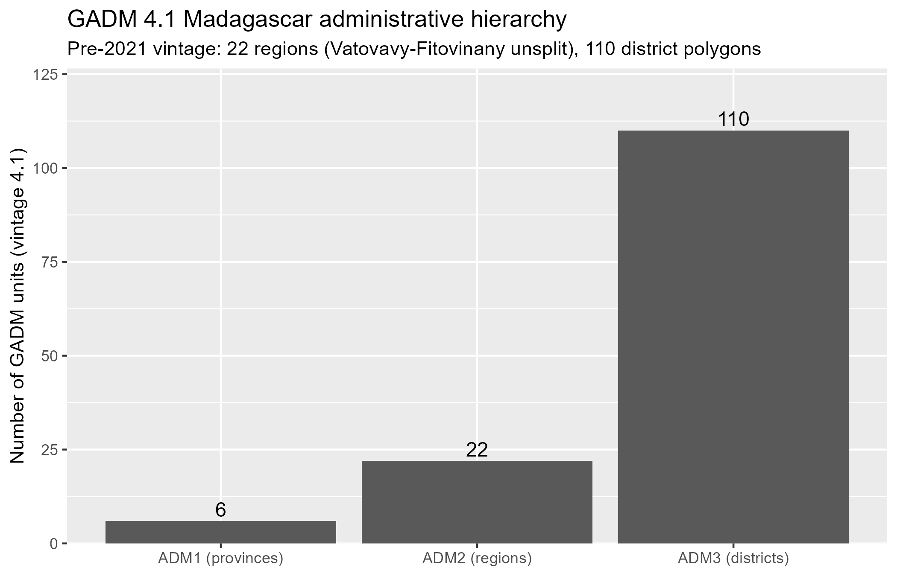
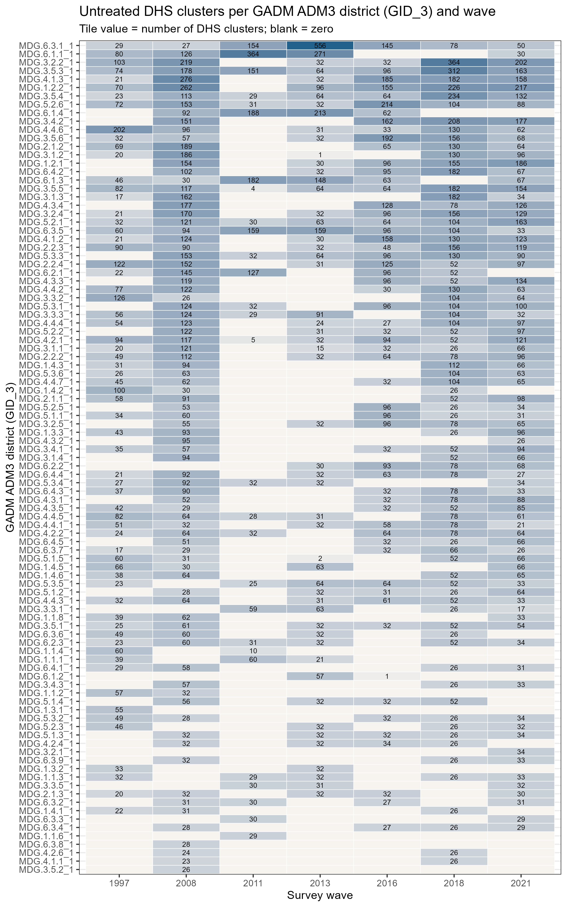
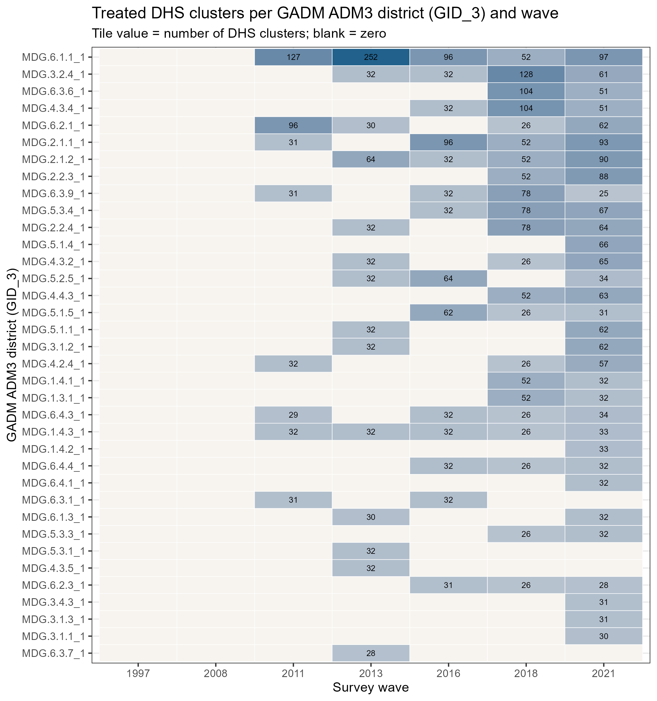
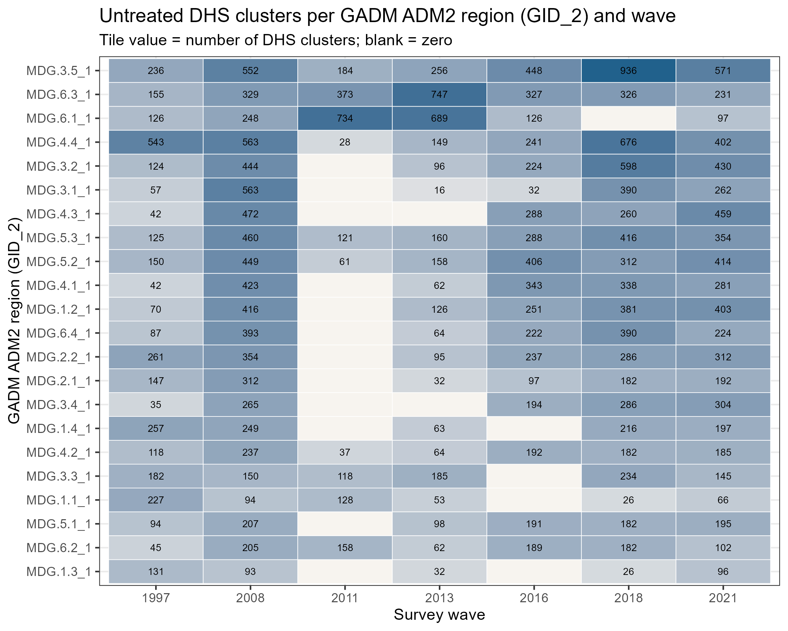
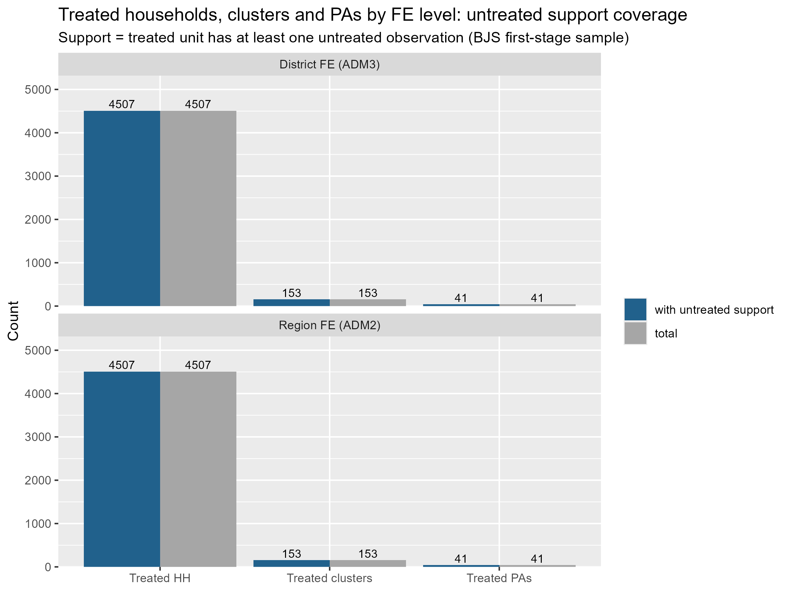
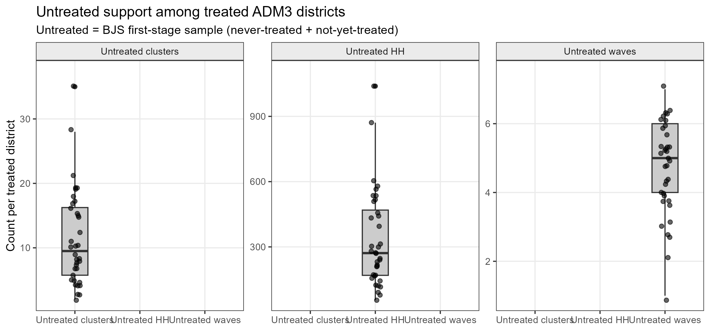

```{r}
#| label: setup
#| include: false
knitr::opts_chunk$set(echo = FALSE, message = FALSE, warning = FALSE)
library(tidyverse)
out_dir <- "output/review_v2/bjs_feasibility"
img <- function(f, w = "100%") knitr::include_graphics(file.path("..", out_dir, f))
read_csv_rel <- function(f) read_csv(file.path("..", out_dir, f), show_col_types = FALSE)
```

**Scope statement.**

> This audit was conducted without loading or estimating any real study outcome. The choice between region and district fixed effects, and the feasibility of the historical event-time bins, is evaluated exclusively from administrative geography, treatment timing, support, covariates, and estimator mechanics.

> The historical two-year bin boundaries predate the current outcome analysis and are not altered here.

All frozen choices were respected (profile cardinality matching, `tols = 0.095`, the five PAP matching covariates, frozen matched datasets, `treatment_date`/`treated_now`, June-1 survey reference date, historical 2-year event-time bins). No treatment effect was estimated. Implementation: `scripts/audit_bjs_geographic_fe.R`.

## 1. GADM hierarchy and entity counts

`geodata` 0.6.6 (`gadm(country = "MDG", level = 3)`, GADM **4.1** vintage) returns:

| Level | Count | Interpretation |
|---|---|---|
| GID_1 | 6 | former provinces |
| GID_2 | 22 | **regions** |
| GID_3 | 110 | **districts** |

GADM 4.1 no longer ships `TYPE_*`/`ENGTYPE_*` columns (they are absent at levels 1–2 and all-`NA` at level 3), so ADM3 = districts is confirmed structurally rather than by a type label: the `NAME_3` entities are districts (e.g. Ambohidratrimo, Andramasina, Anjozorobe under Analamanga), nested 110-per-22 under the 22 regions of `GID_2`.

**Vintage note (documented, not treated as an error).** The user expectation of "~23 regions / ~120 districts" refers to the *current* official structure. Madagascar's 23rd region (Vatovavy, split from Vatovavy-Fitovinany) dates from June 2021, and the official district count is 119. The GADM 4.1 layer used here is the **pre-2021 vintage**: 22 regions with Vatovavy-Fitovinany unsplit, and 110 district polygons — fewer than the official 119. Throughout this audit, current GADM is used as a **harmonized persistent spatial partition**, not as survey-year-specific historical administrative codes.

{#fig-gadm-counts}

## 2. Confirmation of region/district levels

- **Region FE candidate** = `GID_2` (ADM2, 22 units, pre-2021 regions).
- **District FE candidate** = `GID_3` (ADM3, 110 units = districts).
- FE identifiers are GADM **IDs** (`GID_2`, `GID_3`), never names.

## 3. Cluster-to-ADM assignment coverage

Cluster coordinates were taken once per wave × cluster (`DHSYEAR × hv001`) from the raw GPS layers (DHS `GE` shapefiles; 2018 MICS GPS), matched to the frozen matched datasets (1,269 matched clusters across the seven waves 1997–2021).

- **1,269 / 1,269 matched clusters assigned to ADM3 (100%).**
- 1,266 fall inside a district polygon; **3 clusters** (2008/224, 2008/289, 2011/75) landed in boundary gaps — all within **0.6 km** of a district boundary, consistent with the DHS ±5 km coordinate displacement. They were assigned to the nearest ADM3 polygon (documented flag `assigned_by_nearest`), not dropped.
- **Regions represented:** 22/22. **Districts represented:** 99/110.
- **Border sensitivity (flag only, no exclusion):** 400 matched clusters (31.5%) lie within 5 km of an ADM3 boundary (`border_5km`).

Export: `output/review_v2/bjs_feasibility/cluster_admin_crosswalk.csv`.

## 4. Region-FE support

From `region_fe_support.csv` (per-unit rows for all 22 GADM regions):

| Quantity | Value |
|---|---|
| GADM regions | 22 |
| Represented in matched sample | 22 |
| Regions with treated observations | 17 |
| Regions with untreated observations | 22 |
| Treated regions with untreated support (`fe_identified`) | **17 / 17** |
| Median untreated HH per treated region | 1,380 |
| Median untreated clusters per treated region | 50 |
| Median untreated waves per treated region | 6 |

"Untreated" = the BJS first-stage sample (`treated_bjs == 0`): never-treated controls **plus** not-yet-treated observations of treated groups.

## 5. District-FE support

From `district_fe_support.csv` (per-unit rows for all 110 GADM districts):

| Quantity | Value |
|---|---|
| GADM districts | 110 |
| Represented in matched sample | 99 |
| Districts with treated observations | 36 |
| Districts with untreated observations | 99 |
| Treated districts with untreated support (`fe_identified`) | **36 / 36** |
| Median untreated HH per treated district | 271.5 |
| Median untreated clusters per treated district | 9.5 |
| Median untreated waves per treated district | 5 |

Weakest treated districts (by untreated HH) remain positive-support: Arivonimamo (55 untreated HH, 2 clusters, 1 wave), Ambatolampy (79), Toliary (91), Ivohibe (116). No treated district has zero untreated support.

## 6. District × wave untreated heatmap

{#fig-district-untreated}

## 7. District × wave treated heatmap

{#fig-district-treated}

## 8. Region × wave untreated heatmap

{#fig-region-untreated}

## 9. Treated-unit FE support comparison

Row-level counts (per-unit sums double-count PAs whose treated households straddle units, so PAs are counted as distinct `WDPAID` among treated rows):

| Level | Treated HH | Clusters | PAs | HH supported | Clusters supported | PAs supported |
|---|---|---|---|---|---|---|
| Region FE (ADM2) | 4,507 | 153 | 41 | **4,507 (100%)** | **153 (100%)** | **41 (100%)** |
| District FE (ADM3) | 4,507 | 153 | 41 | **4,507 (100%)** | **153 (100%)** | **41 (100%)** |

Zero treated households, clusters, or PAs sit in units without untreated support under either FE level.

{#fig-support-comparison}

{#fig-district-dist}

## 10. Fake-outcome region BJS mechanics

Installed implementation: **`didimputation` 0.3.0** (source-inspected, not memory-based). `did_imputation()` estimates the first stage on the untreated sample (`treated_bjs == 0`, i.e. never-treated plus not-yet-treated), predicts for all rows, and the estimator is a weighted aggregation of imputed residual gaps. Rows whose prediction is `NA` are silently dropped — the audit below replicates the first stage independently to expose exactly this.

Exact region first stage (frozen 07b PAP controls; persistent region FE, **not** region×year):

```r
fake_y ~ spei_wc_n_1 + hv219_femme + hv220 + treecover_area_2000 +
         slope_2000 + elevation_2000 + population_count_2000 +
         traveltime_2000_2000 | region_id + DHSYEAR
```

| Audit item | Value |
|---|---|
| Estimation rows (complete cases on PAP controls + `w_all`) | 36,519 |
| First-stage (untreated) rows | 32,132 |
| Treated rows targeted | 4,387 |
| Treated rows imputed | **4,387 (100%)** |
| Treated rows dropped / unimputable | **0** |
| FE collinearity warnings | none (`feols` re-run with `warn = TRUE`) |
| Singleton FE levels | 0 |
| Clustering units (`cluster_var = region_id`) | 22 |

The run completed; the fake-outcome estimate is mechanically valid and substantively meaningless. `w_all` (= DHS survey weight × frozen profile-design weight) enters as WLS weights in the first stage, in the weight-normalized aggregation of imputed gaps, and in the influence-function variance.

## 11. Fake-outcome district BJS mechanics

Exact district first stage:

```r
fake_y ~ spei_wc_n_1 + hv219_femme + hv220 + treecover_area_2000 +
         slope_2000 + elevation_2000 + population_count_2000 +
         traveltime_2000_2000 | district_id + DHSYEAR
```

| Audit item | Value |
|---|---|
| Estimation rows | 36,519 |
| First-stage rows | 32,132 |
| Treated rows targeted | 4,387 |
| Treated rows imputed | **4,387 (100%)** |
| Treated rows dropped / unimputable | **0** |
| FE collinearity warnings | none |
| Singleton FE levels | 0 |
| Clustering units (`cluster_var = district_id`) | 99 |

All 99 district FE levels represented in the matched data survive in the first stage (minimum 26 first-stage rows per district). 911 rows carry zero matching weight and are mechanically inert (zero weight in both the first stage and the aggregation); treated rows among them are "imputable" but contribute nothing.

Exports: `bjs_region_fake_run_audit.csv`, `bjs_district_fake_run_audit.csv`.

## 12. Post-bin target feasibility

Custom `wtr` columns are supported by the installed implementation and target each historical post bin directly (each bin is a weight-normalized indicator over its treated rows):

| Bin | Treated HH | Clusters | PAs | Districts | Cohorts | Unimputable targeted |
|---|---|---|---|---|---|---|
| 0:1 | 64 | 2 | 2 | 2 | 1 | 0 |
| 2:3 | 485 | 18 | 13 | 12 | 2 | 0 |
| 4:5 | 789 | 26 | 16 | 16 | 2 | 0 |
| 6:7 | 800 | 25 | 17 | 17 | 3 | 0 |
| 8:9 | 875 | 37 | 22 | 19 | 1 | 0 |
| ≥10 | 1,374 | 45 | 30 | 26 | 1 | 0 |

Every bin produces an estimate at both FE levels; **no targeted treated observation is unimputable in any bin**. The thin early bin (0:1: one annual cohort, 2 districts) is the known weak-cohort result from the previous audit and is unchanged by the FE choice.

Export: `bjs_post_bin_support.csv`.

## 13. Pretrend-bin implementation findings

Source inspection of `didimputation` 0.3.0 establishes:

- `pretrends` adds `i(zz000event_time, keep = c(...))` to the first stage and **re-estimates on the untreated sample** (never-treated + not-yet-treated). The resulting lead coefficients are **regression-based placebo-style leads, not imputation-based placebo estimates** — a valid diagnostic, but not the canonical BJS placebo-imputation pretrend test.
- `keep` requires **exact event-time values**; **custom binned leads are not supported natively**.
- Lead event times actually present in this design: **−18, −17, −12, −7, −6, −4, −2, −1**. The historical pre-bins {≤ −9, −8:−7, −6:−5, −4:−3, −2:−1} therefore do **not** map one-to-one onto available single-year leads (e.g. bin −8:−7 is represented only by −7; −6:−5 only by −6; −4:−3 only by −4).
- Joint pretrend inference is not returned natively. The natural mechanism — a Wald test on the same internal pretrend regression (`fixest::wald(pre_est, keep = "zz000event_time")`) — was mechanically verified (fake outcome, IID vcov); a real analysis would need the clustered vcov propagated.
- Implementing **binned** pre-treatment placebo coefficients would require custom imputation/aggregation (e.g. placebo-treatment redefinition of `g`), which is a design decision for the next step — not improvised here.

## 14. Region vs district comparison

From `region_vs_district_comparison.csv` (design-only; the comparison table uses the estimation sample of the fake runs — complete cases on the PAP controls — whereas the support tables above use the full matched sample):

| Criterion | Region FE | District FE |
|---|---|---|
| FE groups in GADM | 22 (ADM2) | 110 (ADM3) |
| Groups represented in matched data | 22 | 99 |
| Treated groups represented | 17 | 36 |
| Treated groups with untreated support | 17 | 36 |
| Treated HH with identified FE | 4,387 | 4,387 |
| Treated clusters with identified FE | 153 | 153 |
| Treated PAs with identified FE | 41 | 41 |
| Median untreated HH per treated group | 1,380 | 271.5 |
| Median untreated clusters per treated group | 50 | 9.5 |
| Median untreated waves per treated group | 6 | 5 |
| Fake-run imputable treated share | 1.000 | 1.000 |
| Collinearity / singleton warnings | none | none |
| Number of clustering units | 22 | 99 |

## 15. Outcome-free recommendation

**Decision: Case A — district FE is clearly feasible — with region FE retained as the coarser robustness specification (the Case C preference ordering).**

- **Valid persistent geography.** ADM3 districts are a genuine persistent administrative layer, and current GADM is used as a harmonized persistent spatial partition across 1997–2021 (pre-2021 vintage: 22 regions, 110 districts).
- **Adequate empirical support.** Under district FE, 100% of treated HH, clusters, and PAs lie in districts with untreated observations; the fake BJS run imputes 4,387/4,387 targeted treated rows with zero exclusions, no collinearity or singleton problems, and every historical post bin is directly targetable via custom `wtr`.
- **Substance, not automatic fineness.** District FE absorb more persistent spatial heterogeneity than region FE, and the support cost is modest (median 271.5 untreated HH and 9.5 untreated clusters per treated district; weakest treated district still has 55 untreated HH). Region FE are comparatively coarse (17 treated regions, ~1,380 untreated HH each) and remain available as a robustness check.
- **Estimand clarity.** District FE do **not** change the ATT estimand into a "within-district ATT". The FE structure models and imputes untreated potential outcomes; the ATT target is determined by the treated observations and the aggregation weights. What changes is the identification assumption, which becomes an additive/conditional untreated-outcome model involving **district FE, survey-year FE, and the PAP covariates**.
- **Caveats to resolve before the outcome analysis:** (i) the 0:1 post bin remains thin (one annual cohort); (ii) binned pre-treatment placebo coefficients require a custom imputation/aggregation mechanism to be specified; (iii) inference rests on 22 (region) or 99 (district) clusters; (iv) the GADM vintage boundary harmonization is an assumption to be stated in the paper.

No outcome variable was loaded at any point; no treatment effect was estimated.

## Files

- `scripts/audit_bjs_geographic_fe.R` — full reproducible audit
- `output/review_v2/bjs_feasibility/cluster_admin_crosswalk.csv`
- `output/review_v2/bjs_feasibility/region_fe_support.csv`, `district_fe_support.csv`
- `output/review_v2/bjs_feasibility/bjs_region_fake_run_audit.csv`, `bjs_district_fake_run_audit.csv`
- `output/review_v2/bjs_feasibility/bjs_post_bin_support.csv`
- `output/review_v2/bjs_feasibility/region_vs_district_comparison.csv`
- `output/review_v2/bjs_feasibility/*.png` (6 figures)
