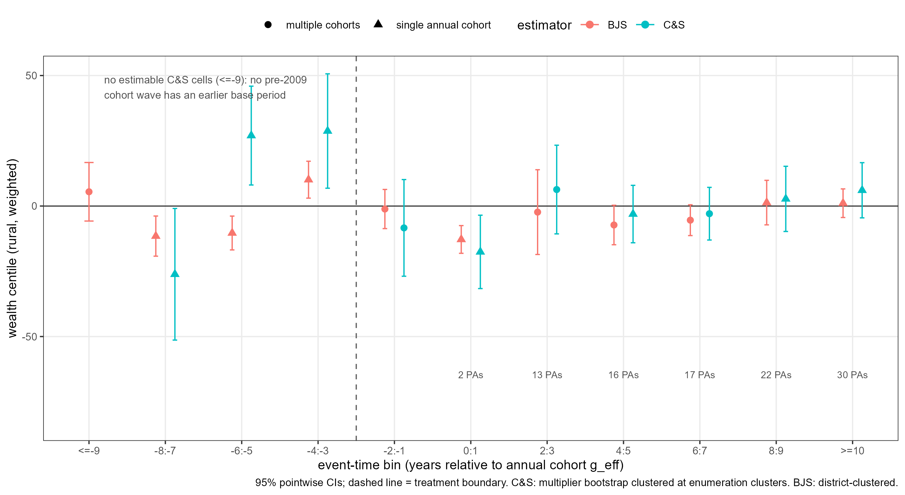
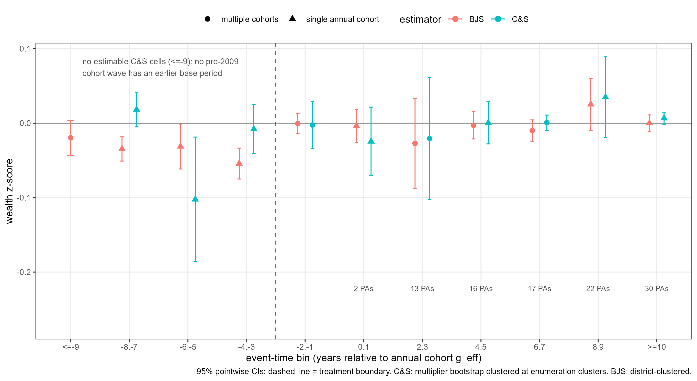

```{r setup, include=FALSE}
knitr::opts_chunk$set(echo = FALSE, message = FALSE, warning = FALSE)
library(tidyverse)
out_dir <- "../output/review_v2/staggered_head_to_head"
```

# 1. Frozen design statement

All estimates below use the frozen design: profile cardinality matching (tols = 0.095),
the five PAP matching covariates, the frozen matched waves (1997, 2008, 2011, 2013,
2016, 2018, 2021), the June-1 survey reference date, frozen `treatment_date`/`treated_now`,
annual exact-date-consistent cohorts `g_eff`, the frozen two-year event-time bins, and
`w_all` = survey weight × frozen profile-design weight. Nothing was retuned after seeing
results (prompt section 22). The preregistered 2×2 remains the primary design; this
comparison is secondary.

# 2. Annual treatment timing and cohorts

```{r}
cohorts <- read_csv(file.path(out_dir, "annual_cohorts_pas.csv"), show_col_types = FALSE)
knitr::kable(cohorts, col.names = c("annual cohort g_eff", "protected areas"),
             caption = "Annual exact-date-consistent treatment cohorts.")
```

Annual cohorts are highly concentrated: the 2009 cohort contains 36 of 43 treated
protected areas; cohorts 2014, 2015 and 2020 contain 1, 4 and 2 PAs. The assertion
`treated_now_from_g == treated_now` passes for all treated observations (0 mismatches).

# 3. Specifications side by side

| | Callaway–Sant'Anna (`did` 2.1.2) | BJS imputation (`didimputation` 0.3.0) |
|---|---|---|
| Design | repeated cross-sections, `panel = FALSE` | repeated cross-sections, imputation |
| Cohorts | annual `g_eff` | annual `g_bjs` (same timing) |
| Comparison group | never-treated | untreated observations (first stage) |
| Adjustments | PAP covariates via IPW in each (g,t) cell | district (ADM3) FE + survey-year FE + PAP covariates |
| Weights | `w_all` | `w_all` |
| Inference | multiplier bootstrap, 1 000 draws, clustered at enumeration clusters (1 269) | district-clustered (99 districts) |
| Estimand | weighted average of ATT(g,t) by group shares | weighted ATT over imputable post-treatment treated rows |

Both estimators use identical samples: 36 519 rows, identical row sets (verified).

# 4. Sample and missingness comparison

```{r}
comp <- read_csv(file.path(out_dir, "estimator_sample_comparison.csv"),
                 show_col_types = FALSE)
knitr::kable(comp, col.names = c("quantity", "value"))
losses <- read_csv(file.path(out_dir, "sample_losses_by_year_group.csv"),
                   show_col_types = FALSE)
```

The full stacked sample has 37 431 rows. 912 rows are dropped for incomplete PAP
covariates; 911 of them are the 2018 zero-weight rows (790 control, 121 treatment,
120 `treated_now`), i.e. the known zero-weight rows are inherited from the frozen
matching/covariate pipeline and are excluded by covariate missingness, not by any
estimator choice. Outcome missingness is zero on covariate-complete rows. C&S and
BJS use exactly the same 36 519 rows; 4 387 post-treatment treated rows, none with
zero weight. BJS cannot impute 79 treated rows (1.8%): all treated rows of district
MDG.1.3.1_1, which has no untreated households — a structural support limit already
documented in the feasibility audit.

```{r}
knitr::kable(losses, digits = 0,
  caption = "Losses by survey year and group (rows, zero-weight rows, outcome missingness).")
```

# 5. H1 overall table (wealth centile, rural, weighted)

```{r}
tab_h1 <- read_csv(file.path(out_dir, "h1_overall_comparison.csv"),
                   show_col_types = FALSE)
tab_h1 |>
  transmute(estimand, estimate = round(estimate, 2),
            SE = round(std.error, 2),
            `95% CI` = paste0("[", round(conf_low, 2), ", ", round(conf_high, 2), "]"),
            `p-value` = round(p_value, 3), n, clusters,
            clustering) |>
  knitr::kable(caption = "H1 overall comparison. Targets differ; see column 'clustering' and section 12.")
```

# 6. H1 head-to-head event study

```{r}

```

```{r}
cs_h1 <- read_csv(file.path(out_dir, "cs_h1_binned_eventstudy.csv"), show_col_types = FALSE)
knitr::kable(cs_h1 |>
  transmute(bin, estimate = round(estimate, 2), SE = round(std.error, 2),
            `95% CI` = paste0("[", round(conf_low, 1), ", ", round(conf_high, 1), "]"),
            cells = n_cells, cohorts, PAs = pas_represented,
            `treated HH` = treated_hh),
  caption = "C&S binned event study, H1 (custom aggregation validated exactly against aggte(dynamic)).")
```

```{r}
bjs_h1_post <- read_csv(file.path(out_dir, "bjs_h1_post_bins.csv"), show_col_types = FALSE)
bjs_h1_pre <- read_csv(file.path(out_dir, "bjs_h1_pre_bins.csv"), show_col_types = FALSE)
knitr::kable(bind_rows(
  bjs_h1_pre |> transmute(bin, estimate = round(estimate, 2),
    SE = round(std.error, 2),
    `95% CI` = paste0("[", round(conf_low, 1), ", ", round(conf_high, 1), "]"),
    `treated HH` = NA_integer_),
  bjs_h1_post |> transmute(bin, estimate = round(estimate, 2),
    SE = round(std.error, 2),
    `95% CI` = paste0("[", round(conf_low, 1), ", ", round(conf_high, 1), "]"),
    `treated HH` = treated_hh)),
  caption = "BJS binned event study, H1 (district-clustered).")
```

# 7. H1 pretrend diagnostics

```{r}
wald <- read_csv(file.path(out_dir, "cs_pretrend_wald.csv"), show_col_types = FALSE)
knitr::kable(wald |> filter(outcome_h == "h1") |>
  transmute(test, W = round(W, 2), df, `p-value` = signif(p_value, 3),
            `native Wpval (diagnostic only)` = native_Wpval_diagnostic),
  caption = "C&S joint test: all displayed pre bins = 0, cluster-robust IF covariance.")
knitr::kable(bjs_h1_pre |> transmute(bin, estimate = round(estimate, 2),
  SE = round(std.error, 2), `95% CI` = paste0("[", round(conf_low, 2), ", ", round(conf_high, 2), "]"),
  leads = n_leads, `lead w_all mass` = round(lead_mass, 1)),
  caption = "BJS pre bins, H1 (leads aggregated with untreated w_all mass weights).")
bjs_res <- readRDS(file.path(out_dir, "bjs_results.rds"))
knitr::kable(bjs_res$h1$pre_wald |> mutate(across(where(is.numeric), ~round(.x, 6))),
  caption = "BJS joint test (district-clustered covariance): all displayed pre bins = 0.")
```

# 8. H2 overall table (wealth z-score)

```{r}
tab_h2 <- read_csv(file.path(out_dir, "h2_overall_comparison.csv"),
                   show_col_types = FALSE)
tab_h2 |>
  transmute(estimand, estimate = round(estimate, 4),
            SE = round(std.error, 4),
            `95% CI` = paste0("[", round(conf_low, 4), ", ", round(conf_high, 4), "]"),
            `p-value` = round(p_value, 3), n, clusters, clustering) |>
  knitr::kable(caption = "H2 overall comparison.")
```

# 9. H2 head-to-head event study

```{r}

```

# 10. H2 pretrend diagnostics

```{r}
bjs_h2_pre <- read_csv(file.path(out_dir, "bjs_h2_pre_bins.csv"), show_col_types = FALSE)
knitr::kable(wald |> filter(outcome_h == "h2") |>
  transmute(test, W = round(W, 2), df, `p-value` = signif(p_value, 3),
            `native Wpval (diagnostic only)` = native_Wpval_diagnostic),
  caption = "C&S joint test, H2.")
knitr::kable(bjs_h2_pre |> transmute(bin, estimate = round(estimate, 4),
  SE = round(std.error, 4), `95% CI` = paste0("[", round(conf_low, 4), ", ", round(conf_high, 4), "]"),
  leads = n_leads, `lead w_all mass` = round(lead_mass, 1)),
  caption = "BJS pre bins, H2.")
knitr::kable(bjs_res$h2$pre_wald |> mutate(across(where(is.numeric), ~round(.x, 8))),
  caption = "BJS joint test, H2 (district-clustered).")
```

# 11. BJS region-FE robustness

```{r}
reg_h1 <- read_csv(file.path(out_dir, "bjs_region_robustness_h1.csv"), show_col_types = FALSE)
reg_h2 <- read_csv(file.path(out_dir, "bjs_region_robustness_h2.csv"), show_col_types = FALSE)
knitr::kable(bind_rows(
  reg_h1 |> mutate(outcome = "H1"),
  reg_h2 |> mutate(outcome = "H2")) |>
  transmute(outcome, estimand, bin = tidyr::replace_na(bin, "overall"),
            estimate = round(estimate, 4), SE = round(std.error, 4),
            `95% CI` = paste0("[", round(conf_low, 4), ", ", round(conf_high, 4), "]")),
  caption = "Region-FE robustness (22 region clusters only; robustness, never primary).")
```

There are only 22 region clusters, so region-clustered inference is fragile; region FE
is reported for robustness only and was not promoted on the basis of p-values.

# 12. Methodological comparison

**Where the estimators agree.** Both use the same frozen timing, weights, covariates,
bins and sample. Both overall ATTs are statistically indistinguishable from zero for H1
and H2, and both event studies put the informative pre period (`-2:-1`) near zero with
wide uncertainty. Both joint binned pretrend tests reject, and in both cases the
rejection is driven by the sparse-cohort placebo bins (`-8:-7`, `-6:-5`, `-4:-3`),
which come from the 1-PA (2014) and 4-PA (2015) cohorts.

**Where they differ.** (i) *Estimand*: C&S targets a group-share-weighted average of
ATT(g,t) (dominated by the 2009 cohort); BJS targets a weighted ATT over imputable
post-treatment treated rows under an additive untreated-outcome model with district FE,
survey-year FE and PAP covariates. These are not the same parameter and need not agree.
(ii) *Support*: C&S cannot estimate any cell at event time `<= -9` (no pre-2009 cohort
wave has an earlier base period), and several later-cohort cells are not estimable;
BJS imputes 4 308 of 4 387 post-treatment treated rows. (iii) *Precision*: BJS
district-clustered SEs are smaller, but this partly reflects the parametric untreated
model pooling all districts and years; C&S SEs reflect cell-by-cell estimation with
very small cohorts. (iv) *Identifying assumptions*: C&S relies on parallel trends
conditional on covariates within (g,t) cells; BJS relies on a correctly specified
additive untreated-outcome model (with the same covariates) plus district and year
fixed effects — GADM ADM3 is a harmonized persistent partition, which supports the
district FE, but the additive specification is a stronger functional-form assumption.

**Interpretation rules respected here.** Non-rejection of pretrends is not proof of
parallel trends, and rejection here is not evidence that treatment effects are
confounded — it mainly flags that the sparse cohorts' placebo cells are imprecise and
unstable. Pretrend uncertainty (bin SEs of roughly 9–13 wealth centiles for C&S) is of
the same order as post-treatment point estimates, so the event study cannot
discriminate effect sizes of the magnitude estimated. The 2009 cohort dominates every
informative post bin for C&S; later-cohort bins must not be overinterpreted.

# 13. Manuscript-oriented recommendation

Based on design credibility, estimand relevance, support, precision and clarity — not
on preferred signs or p-values:

1. **Main multi-period estimator.** Keep the preregistered frozen 2×2 as the primary
   result. If a staggered estimator is promoted to the main text, C&S (annual cohorts,
   never-treated, IPW) is the more defensible choice: its estimand is transparent, its
   cell-level support is auditable, and it does not hinge on an additive untreated
   model. Its weakness is the 2009-cohort dominance, which must be stated.
2. **Robustness estimator.** BJS with district FE, reported with its support limits
   (79 unimputable rows; district-clustered, 99 clusters) and the explicit caveat that
   agreement or disagreement with C&S does not validate either design.
3. **Event-study figure in the main manuscript?** No. Given the pretrend rejections in
   both designs, the sparse-cohort bins and the empty `<= -9` bin, the binned
   event-study figure belongs in the supplement; the main text should carry the
   2×2 endpoint plus the overall staggered ATTs.
4. **Pretrend diagnostics.** Main text: the 2×2 1997–2008 placebo (already
   preregistered) and a one-sentence statement of the binned joint tests. Supplement:
   the full binned event studies, per-bin support tables and both joint tests with
   their covariance details.
5. **Linking staggered results to the 2×2.** Suggested wording: "As a robustness
   check, two modern staggered-adoption estimators using the same frozen treatment
   timing, weights and covariates (Callaway–Sant'Anna with annual cohorts; a
   Borusyak–Jaravel–Spiess imputation estimator with district fixed effects) yield
   overall effects statistically indistinguishable from zero and from the
   preregistered 2×2 endpoint estimate, with wide uncertainty that reflects limited
   post-treatment support (43 treated protected areas, 36 treated in 2009)."
