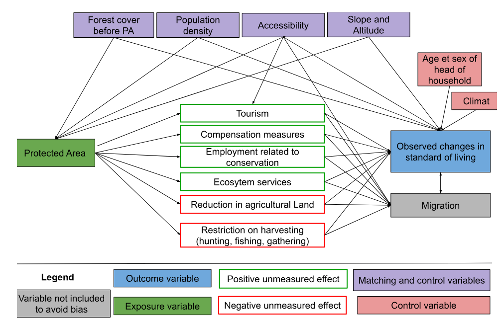

## Introduction

The reconciliation between conservation and development has been a long-discussed issue within the scientific community [@Adams2004], but its importance has grown considerably over the past decade with the rapid expansion of protected ares (PA). This issue is particularly relevant for all 195 COP15 signatory states, which have committed to increasing PA coverage to 30% of terrestrial land by 2030.

In theory, PA can have significant impacts on local livelihoods, both positive and negative. They are recognized as an essential tool for biodiversity conservation [@Maxwell2020], but their creation can deprive nearby communities of access to revenue-generating activities based in natural resources (gathering, hunting, fishing, and harvesting medicinal plants), reduce the amount of land available and restrict economic activities (agriculture, livestock, construction) [@Kandel2022]. Conversely, they can be accompanied by compensation measures (local development projects, cash transfers), generate economic benefits (jobs in PA, tourism), and enhance ecosystem services (increased water resources, erosion control, fire prevention) [@Kandel2022].

Despite these ambivalent potential effects, empirical studies that rigorously assess the impact of PA on people's livelihoods are still rare. Of the 1,043 studies applied to 104 countries reviewed by McKinnon et al. [@McKinnon2016], only 19 used quantitative methods to evaluate impacts on material living conditions or economic well-being. This meta-analysis shows that the results of studies vary widely depending on the methods used, the context studied, and the location. Kandel et al.[@Kandel2022] have updated and extended this analysis by focusing on a corpus of 30 quantitative evaluations specifically address to the impact of PA on household income. They show that PA can have a positive impact on local economies, but that this effect is generally modest and depends on the local context. This variability in impacts highlights the importance of conducting context-specific studies using robust quantitative methods.

Madagascar stands out as a particularly relevant case study for analyzing the relationship between conservation and socioeconomic conditions. The country is the poorest in terms of the first target of the Sustainable Development Goals (SGD 1-1), with the highest proportion of the population living below the international poverty line in the world @Conceicao2024[pp. 298-299]. In 2008, terrestrial PA covered 3.6% of Madagascar and 9% of the population lived within 10 km of a PA. Today, they cover 10.8% and 28% of the population live within 10 km of PA. Madagascar is also characterized by a low state capacity [@Hanson2021], which makes it difficult to implement conservation and sustainable development policies and the social measures that should accompany them. These factors, combined with the high dependence of the rural population on natural resources, mean that the impacts of PA are potentially different from those observed in less precarious contexts.

However, empirical studies at the national scale are almost non-existent for Madagascar. None of the quantitative impact evaluation identified by McKinnon et al. [@McKinnon2016] covered the country. One of the references consolidated by Kandel et al. [@Kandel2022] is a multi-country study that includes Madagascar, but it is based on an estimate of an aggregate impact at the commune level and covers only one date. It uses the 1993 census data to match the country’s municipalities [@Mammides2019], without a before-and-after comparison, and in a context where less than 3% of the territory was covered by PA, most of which had been created several decades earlier.

In this articles, our contribution to the litterature is twofold, both empirical and methodological. Empirically, this study provides an unprecedented national analysis, covering 137 PA established between 2008 and 2021, to evaluate the socioeconomic impacts of forest conservation in contexts of poverty and weak governance. Methodologically, it incorporates recent developments in econometrics to adapt these methods to the study PA. The procedure we propose here could be replicated in other countries, starting with the 39 countries that have at least three geolocated DHS surveys. This approach paves the way for a more systematic evaluation of the impact of PA, taking into account the specific context of each country.To avoid any temptation to "specification searching", we planned and documented our analysis procedure prior to conducting the impact assessment, and our analysis plan was submitted with a dated and verifiable certification on the OSF portal in March 2025. 

In the following section [@theoryofchange], we present the theory of change to explain the mechanisms through which PA could influence local household well-being, as well as the expecteds effects. Section [@data] describes all of the studies and data used in the analysis. Section [@empiricalstrategic] presents the econometric approaches used to assess the effect of PA on household livelihoods, the effect of PA on inequalities between households, and the heterogeneity of effects according to the type of PA governance. Section [@resultats] presents our main results and proposes a series of robustness tests. Section [@Conclusion] concludes. 

## Theory of change {#theoryofchange}
Our evaluation model is based on a theory of change that links the implementation of PA(treatment) to local household well-being (the targeted results) (@fig-theory-change)
The objective here is to determine the impact of PA on observed changes in well-being. Kandel et al.[@Kandel2022] report a slightly positive average impact, but highlight a large heterogeneity of results across context. Several parameters are likely to influence impact, as represented graphically in @fig-theory-change, in the form of directed acyclic graph [@Hunermund2023]. If the mechanisms represented affect all residents of a locality in a convergent manner, they should have a significant impact (positive or negative) on the average well being (hypothesis 1). If, on contrary, they affect them in very different ways, they may have no average impact on the well-being, but may increase inequalities (hypothesis 2)

{#fig-theory-change width=70%}

The factors likely to lead to a decline in well-being seem particularly significant in the Malagasy context, where the population is predominantly rural and living in extreme poverty (the last assessment was in 2012, with 80.7% of the population below the $2.15 a day threshold at 2017 PPP). Six studies conducted in Madagascar between 1995 and 2006 estimated the opportunity cost of losing access to PA (slash-and-burn agriculture, hunting, gathering, timber, etc.) at between USD 39 and 177 per housejold per year [@Neudert2017]. Golden et al.[@Golden2014] estimated that income from hunting accounted for 57% of household's cash income in areas adjacent to the Makira and Masoala PA. Another survey of people living near Makira estimated the value of pharmaceutical use at USD 30-44 per year per household, based on the subsidized price of equivalent treatments in the Malagasy market [@Golden2012]. 

Several factors that could help improve livelihoods through conservation appear to be fragile in Madagascar, starting with tourism. Naidoo et al. [@Naidoo2019] aggregate data from DHS surveys conducted between 2001 and 2011 in 34 developing countries. Their study is based on matching households near and far from PA, but with no pre-post conservation comparison. They highlight positive impacts , but only for a subset of PA 'with documented tourism'. According to their study, households living near the PA 'with tourism' are 17% wealthier and 16% less likely to be poor than similar households living far from these areas. 

However, tourism in Madagascar’s PA remains low. According to data from Madagascar National Parks (MNP), only 7 PA recorded more than 10,000 visitors in 2023 (with a maximum of 30,744 in Isalo), which is low compared to the average of 356,405 visitors per year and per PA recorded in 929 PA worldwide in the global study by Chung et al. [@Chung2018].

When new PA are created in Madagascar, compensation mechanisms for local populations remain rare, ineffective and insufficient (Rivière 2017; Bertrand et al. 2014). The most in-depth study on this subject, conducted by Poudyal et al. [@Poudyal2018] with support from the World Bank, focuses on the Ankeniheny Zahamena Corridor (CAZ), created in 2015 to connect several existing PA. Five study sites were selected: Two adjacent to the new CAZ PA (one eligible for compensation, the other not), two adjacent to long-established PA, and one far from the forest boundary. The median cost of the conservation restriction is estimated at USD 2,375 per household per year, representing 27% to 84% of the average annual income. The amounts set aside to compensate beneficiary households were assessed to be insufficient relative to the losses incurred, and 50% of households eligible for compensation received nothing [@Poudyal2018; @Poudyal2016]. 

Our firts set of results therefore consists of determining whether PA in Madagascar, by limiting access to natural resources, have negative impacts on the standard of living of households living nearby, which often exceed the benefits of compensation and ecosystem services, with more adverse effects than in other countries. 

The impact mechanisms represented in @fig-therory-change are likely to affect households differently depending on their prior characteristics. Compensation measures are generally implemented in the form of projects to promote income-generating activities (agriculture, livestock, handicrafts) in surrounding communities [@Poudyal2018]. In the context of such development projects, individuals known as “development brokers” frequently emerge as intermediaries between local communities and implementing organizations. By mobilizing their social networks and specific skills, these brokers manage to capture a disproportionate share of the benefits of interventions, whether in form of income or access to exclusive opportunities. This dynamic can reinforce pre-existing inequalities within communities, limiting the access of the most vulnerable households to the expected benefits of compensation programs. 

Although tourism development is often presented as an opportunity for economic growth, it also tends to exacerbate socioeconomic inequalities, particularly in developing countries. Adeniyi et al. (2024) show that in Southern Africa, tourism can initially exacerbate inequalities by concentrating benefits in the most attractive regions, while leaving marginalized communities out of the economic benefits. According to Ghosh and Mitra (2021), the relationship between tourism and inequality follows an inverted Kuznets curve in developing countries, when tourism remains moderate, its growth reduces inequalities, but when tourism becomes massive, further expansion worsens inequalities. Finally, Xuanming et al. (2024) point out that while tourism helps to improve certain socioeconomic indicators, it can also generate inflationary pressures and strain local resources, particularly affecting the most vulnerable households. 

IUCN status of PA are frequently used to explain differences in effectiveness between them. For example, Naidoo et al. [@Naidoo2019] show that multiple-use PA (statuses V and VI) tend to have more beneficial effects than strict areas (statuses I to IV), partly due to greater flexibility in integrating local needs. Beyond status alone, governance plays a central role. Eklund et al [Eklund2017] highlight the importance of transparent and inclusive structures to maximize the positive effects of PA on conservation and social justice. Similarly, Eklund et al [@Eklund2019] call for management approaches to be adapted to local contexts, with greater involvement of communities in decision-making processes, to better reconcile conservation and development objectives. 

This diversity is particularly evident in Madagascar. Although governed by similar formal statuses, PA follow different paths depending on the local context and the way in which they are implemented. Froger and Méral [@Froger2009] show that the early initiatives of shared governance, gradually introduced with in-depth mediation efforts, achieved encouraging results by strengthening local community support. However, from the 2000s onward, the accelerated deployment of management transfers, driven by quantitative targets, often led to hasty and less contextually adapted implementations, undermining the effectiveness of these mechanisms. These experiences demonstrate that, beyond the PA status, their establishment period, management approach, and level of community participation significantly influence their socioeconomic impacts(hypothesis 3).

## Data {#data}
Considering the long-term, large-scale, complex, and politically sensitive nature of the intervention to be evaluated, along with the availability of relevant data at the national level, experimentation appears neither feasible not appropriate. As a result, our study is observational in nature. It uses secondary data on the socioeconomic conditions of households, their geographical environment and their location in relation to PA. 

### Protected areas {#protectedareas}

### Household socioeconomic conditions {#householdsocioeconomicconditions} 

### Household geophysical environment {#householdgeophysical environment}

## Descriptive statistics {#descriptivestatistics}

## Empirical strategic {#empiricalstrategic}

### Matching methods {#matchingmethods}

### Difference-in-difference {#difference-in-difference}

### Robustness and sensitivity tests {#robustnessandsensitivity}

## Resultats {#resultats}

### Matching between treatment and control {#matchingbetweentreatmentandcontrol}

### Overall impact on livelihoods {#overallimpactonlivelihoods}

### Effect on inequalities {#effectoninequalities}

### Heterogeneity {#heterogeneity}

### Robustness {#Robustness}

## Discussion and conclusion {#discussionandconclusion}

## Conclusion {#Conclusion}

Conclusion…

## References

------------------------------------------------------------------------
