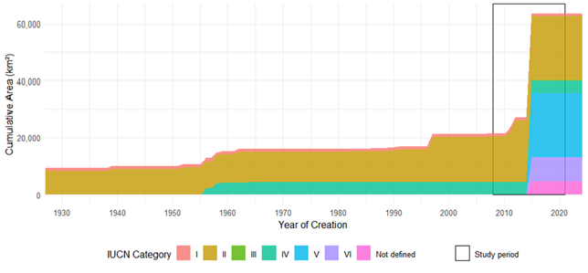
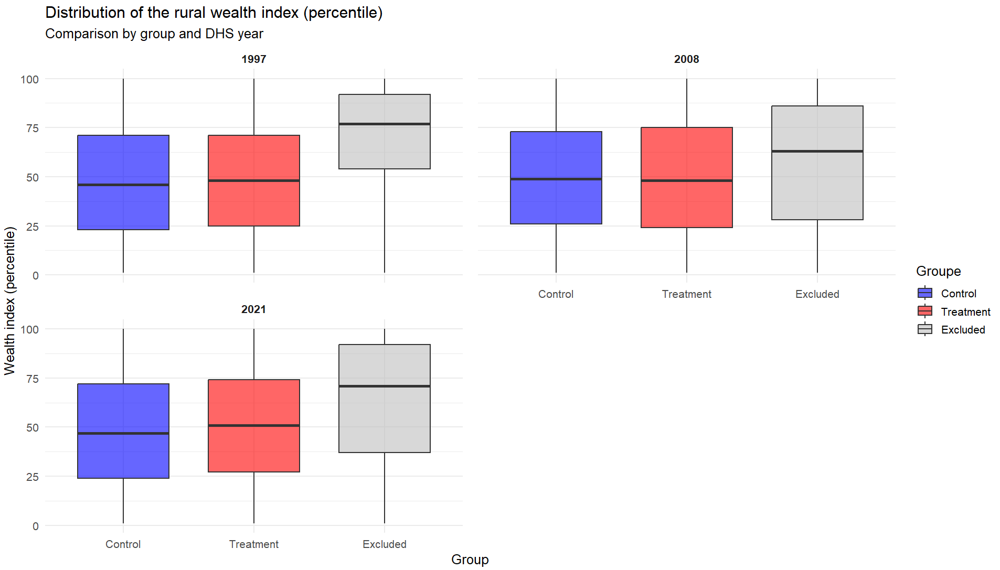
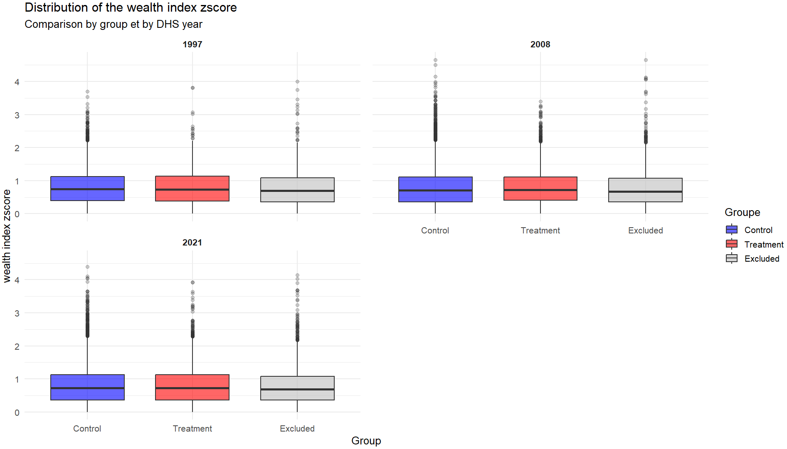

## Introduction

The reconciliation between conservation and development has been a long-discussed issue within the scientific community [@Adams2004], but its importance has grown considerably over the past decade with the rapid expansion of protected ares (PA). This issue is particularly relevant for all 195 COP15 signatory states, which have committed to increasing PA coverage to 30% of terrestrial land by 2030.

In theory, PA can have significant impacts on local livelihoods, both positive and negative. They are recognized as an essential tool for biodiversity conservation [@Maxwell2020], but their creation can deprive nearby communities of access to revenue-generating activities based in natural resources (gathering, hunting, fishing, and harvesting medicinal plants), reduce the amount of land available and restrict economic activities (agriculture, livestock, construction) [@Kandel2022]. Conversely, they can be accompanied by compensation measures (local development projects, cash transfers), generate economic benefits (jobs in PA, tourism), and enhance ecosystem services (increased water resources, erosion control, fire prevention) [@Kandel2022].

Despite these ambivalent potential effects, empirical studies that rigorously assess the impact of PA on people's livelihoods are still rare. Of the 1,043 studies applied to 104 countries reviewed by McKinnon et al. [@McKinnon2016], only 19 used quantitative methods to evaluate impacts on material living conditions or economic well-being. This meta-analysis shows that the results of studies vary widely depending on the methods used, the context studied, and the location. Kandel et al.[@Kandel2022] have updated and extended this analysis by focusing on a corpus of 30 quantitative evaluations specifically address to the impact of PA on household income. They show that PA can have a positive impact on local economies, but that this effect is generally modest and depends on the local context. This variability in impacts highlights the importance of conducting context-specific studies using robust quantitative methods.

Madagascar stands out as a particularly relevant case study for analyzing the relationship between conservation and socioeconomic conditions. The country is the poorest in terms of the first target of the Sustainable Development Goals (SGD 1-1), with the highest proportion of the population living below the international poverty line in the world @Conceicao2024[pp. 298-299]. In 2008, terrestrial PA covered 3.6% of Madagascar and 9% of the population lived within 10 km of a PA. Today, they cover 10.8% and 28% of the population live within 10 km of PA. Madagascar is also characterized by a low state capacity [@Hanson2021], which makes it difficult to implement conservation and sustainable development policies and the social measures that should accompany them. These factors, combined with the high dependence of the rural population on natural resources, mean that the impacts of PA are potentially different from those observed in less precarious contexts.

However, empirical studies at the national scale are almost non-existent for Madagascar. None of the quantitative impact evaluation identified by McKinnon et al. [@McKinnon2016] covered the country. One of the references consolidated by Kandel et al. [@Kandel2022] is a multi-country study that includes Madagascar, but it is based on an estimate of an aggregate impact at the commune level and covers only one date. It uses the 1993 census data to match the country’s municipalities [@Mammides2019], without a before-and-after comparison, and in a context where less than 3% of the territory was covered by PA, most of which had been created several decades earlier.

In this articles, our contribution to the litterature is twofold, both empirical and methodological. Empirically, this study provides an unprecedented national analysis, covering 137 PA established between 2008 and 2021, to evaluate the socioeconomic impacts of forest conservation in contexts of poverty and weak governance. Methodologically, it incorporates recent developments in econometrics to adapt these methods to the study PA. The procedure we propose here could be replicated in other countries, starting with the 39 countries that have at least three geolocated DHS surveys. This approach paves the way for a more systematic evaluation of the impact of PA, taking into account the specific context of each country.To avoid any temptation to "specification searching", we planned and documented our analysis procedure prior to conducting the impact assessment, and our analysis plan was submitted with a dated and verifiable certification on the OSF portal in March 2025. 

In the following section [@theoryofchange], we present the theory of change to explain the mechanisms through which PA could influence local household well-being, as well as the expecteds effects. Section [@data] describes all of the studies and data used in the analysis. Section [@empiricalstrategic] presents the econometric approaches used to assess the effect of PA on household livelihoods, the effect of PA on inequalities between households, and the heterogeneity of effects according to the type of PA governance. Section [@resultats] presents our main results and proposes a series of robustness tests. Section [@Conclusion] concludes. 

## Theory of change {#theoryofchange}
Our evaluation model is based on a theory of change that links the implementation of PA(treatment) to local household well-being (the targeted results) (@fig-theory-change)
The objective here is to determine the impact of PA on observed changes in well-being. Kandel et al.[@Kandel2022] report a slightly positive average impact, but highlight a large heterogeneity of results across context. Several parameters are likely to influence impact, as represented graphically in @fig-theory-change, in the form of directed acyclic graph [@Hunermund2023]. If the mechanisms represented affect all residents of a locality in a convergent manner, they should have a significant impact (positive or negative) on the average well being (hypothesis 1). If, on contrary, they affect them in very different ways, they may have no average impact on the well-being, but may increase inequalities (hypothesis 2)

{#fig-theory-change width=70%}

The factors likely to lead to a decline in well-being seem particularly significant in the Malagasy context, where the population is predominantly rural and living in extreme poverty (the last assessment was in 2012, with 80.7% of the population below the $2.15 a day threshold at 2017 PPP). Six studies conducted in Madagascar between 1995 and 2006 estimated the opportunity cost of losing access to PA (slash-and-burn agriculture, hunting, gathering, timber, etc.) at between USD 39 and 177 per housejold per year [@Neudert2017]. Golden et al.[@Golden2014] estimated that income from hunting accounted for 57% of household's cash income in areas adjacent to the Makira and Masoala PA. Another survey of people living near Makira estimated the value of pharmaceutical use at USD 30-44 per year per household, based on the subsidized price of equivalent treatments in the Malagasy market [@Golden2012]. 

Several factors that could help improve livelihoods through conservation appear to be fragile in Madagascar, starting with tourism. Naidoo et al. [@Naidoo2019] aggregate data from DHS surveys conducted between 2001 and 2011 in 34 developing countries. Their study is based on matching households near and far from PA, but with no pre-post conservation comparison. They highlight positive impacts , but only for a subset of PA 'with documented tourism'. According to their study, households living near the PA 'with tourism' are 17% wealthier and 16% less likely to be poor than similar households living far from these areas. 

However, tourism in Madagascar’s PA remains low. According to data from Madagascar National Parks (MNP), only 7 PA recorded more than 10,000 visitors in 2023 (with a maximum of 30,744 in Isalo), which is low compared to the average of 356,405 visitors per year and per PA recorded in 929 PA worldwide in the global study by Chung et al. [@Chung2018].

When new PA are created in Madagascar, compensation mechanisms for local populations remain rare, ineffective and insufficient (Rivière 2017; Bertrand et al. 2014). The most in-depth study on this subject, conducted by Poudyal et al. [@Poudyal2018] with support from the World Bank, focuses on the Ankeniheny Zahamena Corridor (CAZ), created in 2015 to connect several existing PA. Five study sites were selected: Two adjacent to the new CAZ PA (one eligible for compensation, the other not), two adjacent to long-established PA, and one far from the forest boundary. The median cost of the conservation restriction is estimated at USD 2,375 per household per year, representing 27% to 84% of the average annual income. The amounts set aside to compensate beneficiary households were assessed to be insufficient relative to the losses incurred, and 50% of households eligible for compensation received nothing [@Poudyal2018; @Poudyal2016]. 

Our firts set of results therefore consists of determining whether PA in Madagascar, by limiting access to natural resources, have negative impacts on the standard of living of households living nearby, which often exceed the benefits of compensation and ecosystem services, with more adverse effects than in other countries. 

The impact mechanisms represented in @fig-theory-change are likely to affect households differently depending on their prior characteristics, which would increase inequality (hypothesis 2). Compensation measures are generally implemented in the form of projects to promote income-generating activities (agriculture, livestock, handicrafts) in surrounding communities [@Poudyal2018a]. In the context of such development projects, individuals known as “development brokers” frequently emerge as intermediaries between local communities and implementing organizations. By mobilizing their social networks and specific skills, these brokers manage to capture a disproportionate share of the benefits of interventions, whether in form of income or access to exclusive opportunities. This dynamic can reinforce pre-existing inequalities within communities, limiting the access of the most vulnerable households to the expected benefits of compensation programs. Although tourism development is often presented as an opportunity for economic growth, it also tends to exacerbate socioeconomic inequalities, particularly in developing countries. Adeniyi et al. [@Adeniyi2024] show that in Southern Africa, tourism can initially exacerbate inequalities by concentrating benefits in the most attractive regions, while leaving marginalized communities out of the economic benefits. According to Ghosh and Mitra [@Ghosh2021], the relationship between tourism and inequality follows an inverted Kuznets curve in developing countries, when tourism remains moderate, its growth reduces inequalities, but when tourism becomes massive, further expansion worsens inequalities. Finally, Xuanming et al. [@Xuanming2024] point out that while tourism helps to improve certain socioeconomic indicators, it can also generate inflationary pressures and strain local resources, particularly affecting the most vulnerable households. PA could therefore exacerbate economic inequalities among neighboring communities by creating opportunities that mainly benefit individuals with a higher educational level or a dominant position in the community, allowing them access to rents and jobs related to tourism nd associated activities. 

IUCN status of PA[^1] are frequently used to explain differences in effectiveness between them. For example, Naidoo et al. [@Naidoo2019] show that multiple-use PA (statuses V and VI) tend to have more beneficial effects than strict areas (statuses I to IV), partly due to greater flexibility in integrating local needs. Beyond status alone, governance plays a central role. Eklund et al [@Eklund2017] highlight the importance of transparent and inclusive structures to maximize the positive effects of PA on conservation and social justice. They call for management approaches to be adapted to local contexts, with greater involvement of communities in decision-making processes, to better reconcile conservation and development objectives. 

[^1]: https://www.google.com/url?q=https://portals.iucn.org/library/efiles/documents/PAPS-016-Fr.pdf&sa=D&source=docs&ust=1768418520379026&usg=AOvVaw26wfaFnma2KaAr7cxRAz-5

This diversity is particularly evident in Madagascar. Although governed by similar formal statuses, PA follow different paths depending on the local context and the way in which they are implemented. Froger and Méral [@Froger2009] show that the early initiatives of shared governance, gradually introduced with in-depth mediation efforts, achieved encouraging results by strengthening local community support. However, from the 2000s onward, the accelerated deployment of management transfers, driven by quantitative targets, often led to hasty and less contextually adapted implementations, undermining the effectiveness of these mechanisms. These experiences demonstrate that, beyond the PA status, their establishment period, management approach, and level of community participation significantly influence their socioeconomic impacts. We therefore anticipate that The impacts of PA on well-being and inequalities are heterogeneous, and some PA with good levels of local community participation manage to generate greater benefits and distribute them more equitably (hypothesis 3). 

Based on this theory of change, we define two main outcome variables to explain changes in living outcome variables to explain changes in living standards: household living standards (main variable) and the standardized Z-score of the wealth index (secondary variable). 

Household living standard will be the outcome variable used to determine the overall impact of PA, and the standardized Z-score of the wealth index will explain inequalities in living standards across the localities surveyed. We also use vraibles that may be predictive of the outcome under study. The appropriate covariates for our model are variables that are likely to influence both the probability of treatment (whether a PA has been created near the household) and the outcome (household living standard and inequalities between households). The literature shows that PA tend to be created in less dense, less accessible, higher and steeper regions [@Joppa2010]. These variables may also affect living standards: areas that are more dense, flat, low-lying and accessible (in terms of travel time and geography) tend to be wealthier [@Gallup1999]. We propose five variables (forest cover in 2000, slope, elevation, population density in 2000, and accessibility in 2000). 

## Data {#data}
Considering the long-term, large-scale, complex, and politically sensitive nature of the intervention to be evaluated, we use secondary data on the socioeconomic conditions of households, their geographical environment and their location in relation to PA. 

### Protected areas {#protectedareas}
This study evaluates the impact of terrestrial PA creation on rural household well-being between 2008 and 2021. These time frames was chosen on the basis of the availability of geolocalised data on household living conditions and coincide with a period of strong expansion of PA in the country, as shown in @fig-evo-pa

{#fig-evo-pa width=70%}

::: {.small}
**Source:** Authors’ calculations based on data from the Service de la Gouvernance des Aires Protégées (SGAP),  
Ministère de l’Environnement et du Développement Durable (MEDD).

**Note:** This graph shows the evolution of PA creation in Madagascar since its creation in 1927 (under the colonial administration) until 2024. From 1927 until the early 2000s, PA were characterized by strict conservation (IUCN categories I, II and IV). At the IUCN Parks Summit in Durban in 2003, the Malagasy government committed to trippling the area PA, which led to the creation of new PA with 28 provisional creation decrees published between April 2006 and December 2007 and a global decree bringing the number of new PA to 97 in 2008. The final decree was not issued until 2015, which led to the creation of new PA thereafter. 
:::

Our study analyze the impact of PA surrounding the well being over 13 years (2008-2021). We are using 2008 as the reference year. So, the population considered as treated encompasses households living in rural areas within 10 km of a PA created between 2008 and 2021, according to the GPS coordinates provided in the Demographic Health Surveys (DHS) data[^2]. Households in the control group are those living in a rural area more than 10 km away from a PA created between 2008 and 2021, and they exhibit very similar characteristics or share significant traits with households in the treatment group.We decided to exclude rural populations living within 10 km of PA created before 2008, as they are considered treated before the study period; and in urban areas. 

[^2]: These GPS coordinates correspond to the centroids of the enumeration areas surveyed. To protect respondent confidentiality, these coordinates are first randomly shifted using the following procedure: An offset angle between 0 and 360 is randomly drawn, and then an offset distance is randomly drawn, between 0 and 2 km in urban areas and between 0 and 5 km in rural areas. For 1% of rural clusters, the distance drawn is between 0 and 10 km [@Skiles2013]

We classified PA according to their group affiliation 

{#fig-map-clust width=70%}

**Source:** Authors based on GPS data from DHS clusters

**Note:** Households in the treatment group are those located in clusters less than 10 km from PA created since 2008 in rural areas (shown in red) and households in clusters more than 10 km from PA created since 2008 in rural areas (shown in blue). Rural populations living within 10 km of PA created before 2008 and in urban areas are excluded from the study (shown in black)

Table 1 show the distribution of PA (by number and area) according to the period in which they were created by final decree, taking 2008 as the reference year. In the treatment period (2008 to 2021), 137 PA were created, covering 75,191 km². 

### Household socioeconomic conditions {#householdsocioeconomicconditions} 
The data on household living conditions used for this study comes from surveys conducted by the “Institut National de la Statistique de Madagascar” (INSTAT) as part of the Demographic Health Surveys (DHS)[^3].This data covers a wide range of topics, including demographic characteristics, living conditions, health, education, sanitation, and hygiene. They were conducted based on surveys from 1997, 2008, and 2021, containing 650 clusters in 2021[^4], 585 in 2008[^5], and 268 in 1997[^6].

[^3]: The DHS surveys are based on a two-stage stratified sampling method. The population of interest is divided into 23 study areas corresponding to Madagascar's 22 regions, the capital Antananarivo(considered separately), an the Analamanga region without the capital (to isolate the impact of the capital on regional results). With the exception of the capital two strata were created in each study area. At the first level, enumeration ares (also called 'clusters') are randomly selected within each domain, with a probability proportional to the population of the cluster according to the latest census. At the second level, a sample of households is randomly selected within these clusters to participate in the survey programs

[^4]: 657 clusters were drawn with probability proportional to size. After implementation in the field, 650 of the 657 clusters initially selected were actually visited]

[^5]: 600 clusters were drawn with probability proportional to size. Of the 600 clusters selected, 596 could be surveyed. However, nine other clusters had invalid GPS coordinates, resulting in a total of 585 clusters for 2008

[^6]: 270 clusters were drawn with probability proportional to size. Of the 270 clusters selected, 269 could be surveyed. However, one cluster had invalid GPS coordinates, resulting in a total of 585 clusters for 2008. 

These data are used to construct the variables for the impact assessment model. In this analysis, two outcome variables are considered: household living standards (primary variable) and inequalities in living standards at the level of the surveyed localities (secondary variable). 

    • Main outcome variable: Household living standards
    
The first outcome variable, household living standard, is estimated from the wealth index, calculated specifically for rural areas (variable coded hv270a in the DHS data). The wealth index is defined in the DHS data catalogue as: “A composite measure of a household's cumulative living standard. The wealth index is calculated using easy-to-collect data on a household’s ownership of selected assets, such as televisions and bicycles; materials used for housing construction; and types of water access and sanitation facilities. Generated with a statistical procedure known as principal components analysis, the wealth index places individual households on a continuous scale of relative wealth. DHS separates all interviewed households into five wealth quintiles to compare the influence of wealth on various population, health and nutrition indicators. As a response to criticism that a single wealth index is too urban in its construction and not able to distinguish the poorest of the poor from other poor households, this variable provides an urban- and rural-specific wealth index” (The DHS Program/ICF 2018). As described above, we will translate this wealth index into an integer between 1 and 100, corresponding to the household’s wealth percentile relative to the distribution of the whole sample. 

    • Secondary outcome variable: inequality of household living standards
In addition to the evaluation impact of PA on household living standards, we will seek to understand their influence on socioeconomic inequalities within the affected populations. To do this, we propose to use a standardized Z-Score of the wealth index, allowing for the comparison of the relative distribution of wealth around the mean within the study population, at the level of each survey cluster. 

The Z-Score $Z_i$  for each household $i$ is calculated from the wealth index using the following formula: 

$$
Z_i = \frac{W_i - \mu_W}{\sigma_W}
$$
(1)

 where $W_i$ is the wealth index for household $i$, $μ_W$ represents the average wealth index for all households surveyed in each rural cluster, and $σ_W$ is the standard deviation of households in the cluster. 

    • Control variable
These data also provide us with control variables: age and sex of the head of the household.These characteristics determine the economic opportunities and resource management capacity of households [@LoBue2022]. These variables reduce the unexplained variability of the model and thus enable a more accurate estimate of the treatment. 

### Household geophysical environment {#householdgeophysicalenvironment}
Household geophysical environment data will be obtained using the R package mapme.biodiversity [@Gorgen2022]. This package automates the retrieval and processing of large raster-format data to produce a series of indicators applied to user-defined polygons for specified periods, which are presented and defined. 

We propose the following list: 

    • Forest cover rates in 2000
correspond to the percentage coverage by vegetation with a height of 5 meters or more [@Hansen2013]. This variable is provided by the Global Forest Change dataset, which indicates for each pixel of one arc-second (approximately 30 meters at the equator) an estimate of forest cover in 2000 [@Hansen2013]. In Madagascar, as in other countries, PA have been preferentially created by targeting forest zones [@Wilson2006; @Carvalho2020]. Globally, Naidoo [@Naidoo2019] indicates that forest cover in an area is negatively correlated with the living standards of its inhabitants. 

    • Slope and elevation
are calculated using a digital terrain model from NASA-SRTM ( Shuttle Radar Topography data), which provides an elevation estimate for arc-second pixels [@NASAJPL2020]. Slope is measured as a percentage for each plot, while elevation is measured in meters. These topological variables influence the location of PA [@Joppa2010], as well as the agricultural potential of an area and therefore the living standards of rural populations [@CanavireBacarreza2013].
    
    • Population density in 2000
corresponds to the estimated number of inhabitants per km² based on Worldpop data. Worldpop data provide estimates of population density for the year 2000 at a spatial resolution of about 1 km. They use modeling techniques and combines census data with various geospatial datasets[@WorldPop2018].
    
    • Accessibility in 2000
corresponds to the estimated travel time for households to the nearest cities, measured in minutes. These accessibility data to cities are compiled by the Joint Research Center (JRC), with 2000 as the reference year [@Uchida2011]. Accessibility to cities determines the ability to benefit from the services, products and opportunities they offer and is therefore a key factor in determining living standards in rural areas [@Weiss2018; @INSTAT2020]. 

Each of these variables will be calculated for a circle of 10 km radius around the GPS coordinates of the survey cluster. All households in the same cluster have the same values for forest cover rate in 2000, slope and elevation, population density in 2000 and accessibility in 2000. 

We also integrate the Standardized Precipitation Evapotranspiration Index (SPEI) [@VicenteSerrano2010] for the year preceding the survey. This index is calculated based on a long-term reference (1981-2010) to quantify excess or deficit of rainfall. We use the SPEI for the year prior to the survey. The SPEI is calculated from monthly precipitation and minimum and maximum temperature data from worldclim, using an improved version of the Hargreaves method defined by [@Droogers2002], as implemented in the SPEI R package [@VicenteSerrano2010]. This variable will be calculated for a circle with a radius of 10 km around the GPS coordinates of the cluster.

The data from this source will constitue our matching variables. Matching covariates are used to select units not exposed to conservation (control groups) that are comparable to the exposed units (treatment group). They are appropriate for the matching process are variables likely to influence both the probability of treatment (whether a PA has been created near the household) and the outcome (household living standard and inequalities among households). 

## Descriptive statistics {#descriptivestatistics}

@fig-distr-wi shows that the control and treatment groups have very similar wealth profiles, with averages between 47 and 50, and medians ranging from 46 to 51. In contrast, the excluded group is at the top of the national distribution of wealth, with an average well above 50 and a median between 63 and 77. Its distribution is generally skewed upwards (high p25). This suggests that there is no difference between the control and treatment groups; however, the standard deviations of the two groups indicate a high degree of heterogeneity in household living standards.  

{#fig-distr-wi width=70%}
 

{#fig-distr-zs width=70%}

**Source:** Authors based on GPS data from DHS clusters

**Note:** The graph shows boxplots of the wealth index distribution in percentiles (blue for the control group, red for the treatment group, and grey for the excluded groups). On average, for all years of the study, the wealth index of the two groups is roughly similar.

Dans le tableau A.5, en annexe, nous présentons les statistiques descriptives de notre échantillon. 

## Empirical strategic {#empiricalstrategic}

### Matching methods {#matchingmethods}
Our evalautive approach is based on a counterfactual measure that estimates the causal effect of the treatment, in case the implementation of PA.  This approach is based on a comparison between a treatment group (household living in rural areas within or less than 10 km of PA) and a control group (households living in rural areas more than 10 km from PA created after 2008)[@Schleicher2020; @Desbureaux2021]. The study thus fits within the framework of Rubin's causal model [@Rubin1974], according to which there are several hypothetical outcomes depending on exposure to the treatment. To ensure comparability between groups, we apply the genetic matching (GenMatch) from the R MachtIt package to pair each unit in the treatment group with a unit in the control group that has the same observable characteristics [@Ho2007]. This approach uses a single distance measure, 'Mahalanobis distance matching', to quantify the similarity between the two groups of observations, while taking into account the correlations between covariates and their covariances [@Diamond2013]. It increases the credibility of the results and reduces endogeneity issues [@Ma2020]. We also apply a caliper of 0.25 standard deviation of the Mahalanobis distance to avoid creating pairs with overly large differences  [@Rosenbaum1983]. The validity of this estimation depends on the balance between the treatment and control groups before and after matching. Before matching, we check the balance using the Standardized Mean Difference (SMD), which measures the difference between the means of the covariates in the two groups. After matching, a visual test is performed on the quality of the matching using a quantile-quantile plot. 

### Difference-in-difference {#difference-in-difference}
We assess the PA impact on household living standards and inequalities using the difference-in-difference (DID) method. The DID principle is to compare the wealth index of control and treatment households before and after the establishment of PA(note that our treatment begins in 2008). 

This method relies on the parallel trends assumption,according to which treated and untreated areas evolved similarly prior to the intervention. To validate this hypothesis, we will use as a reference, among the rural households surveyed in 1997, those living in an area located within or less than 10 km of a PA created between 2008 and 2021 (placebo treatment group) and those matched to them using the method described above (placebo control group). We will conduct a placebo test by performing a DID estimation between these groups for the period 1997-2008. If the result of this placebo test is zero or statistically insignificant, the hypothesis of parallel trends is validated. 

In our DID estimates, we use robust standard errors for intra-cluster correlations to manage the dependence of observations within clusters. The aim is to adjust the standard errors by taking into account the intra-cluster correlations present within groups by sampling the outcome variable [@Abadie2021]. This adjustment is calculated based on the model residuals ans an estimate of the intra-cluster variance. We calculate the residuals from the regression model and then use these residuals to construct a ribust variance-covariance matrix. The matrix will adjust the intra-cluster correlation by taking into account the error structure. 

The simplified equation for the difference-in-difference [@Daw2018] is as follows:
 	
$$
Y_{it} = \alpha_0 + \beta_1 \text{Treatment}_i + \beta_2 \text{Post}_t + \delta D_{it} + \varepsilon_{it}
$$				                  (2)

With the parameters defined as:

 $Y_{i t}$: Wealth index for household $i$ in year $t$ (1997, 2008 or 2021)
 
 
 $α_0$: Intercept, representing the baseline wealth index
 
 $β_1$: Coefficient associated with the variable $Treatment_i$
 
 $Treatment_i$: Binary variable that takes the value of 1 for households $i$ affected by a PA (treatment households) and 0 for households $i$ not affected by PA (control households)
 
 $β_2$:  : Coefficient associated with the variable $Post_t$
 
 $Post_t$: Binary variable that takes the value of 1 for the post-treatment year 2021 and 0 for the pre-treatment year 2008
 
 $δ$: Coefficient of interest representing the effect of PA on household living standards $i$ in year $t$
 
 $D_{i t}$: Interaction term between $Treatment_i$ and $Post_t$; It is equal to 1 for treatment households $i$ after the treatment year $t$ and 0 for the other households.
 
$ε_{i t}$: Error term

### Robustness and sensitivity tests {#robustnessandsensitivity}
We implement a series of robustness tests predefined in the pre-analysis plan published prior to the results(published on OSF in March 2025). 

We re-estimate all effects using distances of 5 km and 15 km to ensure the reliability and validation of our methodology. The confidence intervals may be too wide to obtain meaningful conclusions when restricting the study area to 5 km, but comparing the coefficients will allow us to assess the consistency of the results based on the radius. 

We apply Benjamini-Hochber's [@Benjamini1995] False Discovery Rate method to test hypothesis 2 (Pa impact on insequalities between households) and hypothesis 3 (effect on the importance of the PA governance model). These tests are performed to mitigate the risk of incorrectly inferring significant effects by controlling the average proportion of false positives among the results reported as significant. Hypothesis 2 is evaluated using the Z-score outcome variable of the wealth index, and hypothesis 3 is evaluated using the IUCN status of PA. 

In the analysis, the outcome variable may be correlated with unobserved factors or shocks at the household level. Fixed effects methods can correct for many of these factors, but only repeated cross-sectional data area available here. However, this difficulty can be circumvented by using a pseudo-panel approach to estimate fixed effects models at the household cohort level [@Deaton1985]

The model is as follows:

$$
\overline{Y}_{ct} = \theta_c + D_{ct} + \sum_{k=2015}^{2021} \beta \overline{Dist}_{ct} \mathbb{1}(t = k) + \delta \overline{X}_{ct} + \epsilon_i
$$                                     
                                    (3)
${{Y}_{c t}}$: Average value of the household $i$ wealth index
within the cohort $c$ at the period $t$

${θ}_{c}$: Fixed effect controlling for the unobservable variables that remain constant over time at the cohort level

${D}_{c t}$: Time-fixed effects at cohort level

${{Dist}_{ct}}$: Average distance between the location of households
and the boundaries of PA ( where ${{Dist}_{ct}} ∢ 10 km$ within the
cohort $c$ for year $t$

${{X}_{c t}}$: Average of the control variables (rainfall, drought) at cohort level c

${ϵ}_{i}$: Error terms for individuals $i$

However, genetic matching and Doubly Robust DID estimation on a cross-section do not control for unobserved characteristics that may simultaneously affect PA and the outcome variabel (wealth index). To assess the robustness of the results in the face of these potential biases resulting from unobserved confounding variables, we perform a sensitivity analysis using Rosenbaum's method @Rosenbaum2002(form: "prose"), (pp.~105–170)

## Resultats {#resultats}

### Matching between treatment and control {#matchingbetweentreatmentandcontrol}
The distribution analysis of covariates prior to matching shows a significant imbalance between the treatment and control groups table). After matching, for all variables in each year, the SMD improvedcoviates improved. However, the population density varaible in 2000 remains difficult to balance perfectly. This is because PA are not randomly distributed to balance perfectly. This is because PA are not randomly distributed across the landscape: those managed for biodiversity conservation are generally located in more isolated and less populated areas, while those managed for mixed uses are surrounded by denser populationS. A Chung [@Chung2018] point out: "Population density around protected areas managed for mixed puposes is also higher than around protected areas managed primarily for biosiversity conservation. 'This heterogeneity between the human contexts surrounding different types of protected areas creates a lack of overlap in the distribution of population density between the tratment and control groups, making this variable difficult to balance perfectly, even after matching. Nevertheless, we achiev an acceptable balance of covariates (Annexe). The biophysical and domestic characteristic of each household in the treatment and control groups are now comparable. We apply the DID method to our study. 

### Overall impact on livelihoods {#overallimpactonlivelihoods}

### Effect on inequalities {#effectoninequalities}

### Heterogeneity {#heterogeneity}

### Robustness {#Robustness}

## Discussion and conclusion {#discussionandconclusion}

## Conclusion {#Conclusion}

Conclusion…

## References

------------------------------------------------------------------------
